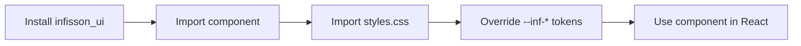

# infisson_ui 组件帮助 / Component Help

这里的每个组件帮助文件都是中英文双语版本，内容与当前公开导出和构建产物同步。完成一个组件前必须补齐对应帮助文件；帮助文件至少包含安装与导入、Props、可复制调用示例、状态与边界、无障碍、主题变量和参考配图。

Every component help file is bilingual and is kept in sync with the public exports and build output. A component is not considered complete until its help file includes installation and import instructions, a Props table, a copyable example, states and edge cases, accessibility, theme variables, and a visual reference.

## 主题变量契约 / Theme-variable contract

组件统一使用语义颜色变量：主题提供 `--inf-color-brand` / `--inf-color-on-brand`、`--inf-color-surface-inverse` / `--inf-color-on-surface-inverse` 等默认配对；直接放在这些背景上的文字必须使用对应的 `on-*` 前景变量。组件不得通过主题名称判断文字颜色，也不得让品牌色背景上的文字继承普通 `--inf-color-text`。

Components use semantic color variables consistently. A theme supplies paired defaults such as `--inf-color-brand` / `--inf-color-on-brand` and `--inf-color-surface-inverse` / `--inf-color-on-surface-inverse`; text placed directly on those surfaces must use the matching `on-*` foreground token. Components must not branch on theme names or let text on a brand surface inherit ordinary `--inf-color-text`.

组件可以提供组件级 CSS 变量，让宿主只覆盖某个实例或插件的颜色。公开覆盖必须将背景和前景成对声明，并在该组件帮助文件中列出变量、默认来源和对比度责任；不要通过内部 DOM 类名或修改全局主题变量来实现局部改色。组件级覆盖只影响颜色，不改变标准尺寸、排版和交互契约。完整变量表见 [`docs/design-tokens.md`](../design-tokens.md)。

Components may expose component-scoped CSS variables so a host can recolor one instance or plugin. Public overrides must declare background and foreground as a pair, and the component help must list the variables, default sources, and contrast responsibility. Do not recolor a single component through internal DOM selectors or by changing global theme tokens. Component overrides affect color only; they do not change the component's standard dimensions, layout, or interaction contract. See the complete table in [`docs/design-tokens.md`](../design-tokens.md).

## 组件索引 / Component index

| 组件 / Component | 帮助文件 / Help file | 公共导出 / Export |
| --- | --- | --- |
| Button | [button.zh-en.md](button.zh-en.md) | `Button`, `ButtonProps` |
| Badge | [badge.zh-en.md](badge.zh-en.md) | `Badge`, `BadgeProps` |
| Tabs | [tabs.zh-en.md](tabs.zh-en.md) | `Tabs`, `TabPanel`, `TabItem` |
| Dialog | [dialog.zh-en.md](dialog.zh-en.md) | `Dialog`, `DialogProps` |
| ScoreGauge | [score-gauge.zh-en.md](score-gauge.zh-en.md) | `ScoreGauge`, `ScoreGaugeProps` |

## 图片映射组件 / Reference-board components

| 区域 / Area | 覆盖 / Coverage | 索引 / Index |
| --- | ---: | --- |
| Global dashboard / 全局仪表盘 | A01–A37 (37) | [global/index.md](global/index.md) |
| Project detail / 项目详情 | B01–B28 (28) | [detail/index.md](detail/index.md) |
| Workflow / 工作流 | C01–C36 (36) | [workflow/index.md](workflow/index.md) |

每个 A/B/C 条目都对应一个独立的 `.zh-en.md` 文件；变体条目（例如 Button dark、ProjectCard delayed）会在同一公共组件 API 下单独说明视觉与状态。Every A/B/C entry has its own `.zh-en.md` file; visual variants are documented separately while sharing the public component API.

配图来自本项目的开发参考素材。图片保留原始素材的 Permitly 来源标记；代码、文案和包名使用 infission / `infisson_ui`。

The images are development references stored in this repository. They retain the original Permitly provenance; implementation copy, package name, and API use infission / `infisson_ui`.

演示中的工作区、地点、公司、地址、人员和业务数据均为虚构 fixture；它们不代表真实机构或真实业务结果。Demo workspaces, places, organizations, addresses, people, and business data are fictional fixtures and do not represent real entities or outcomes.

