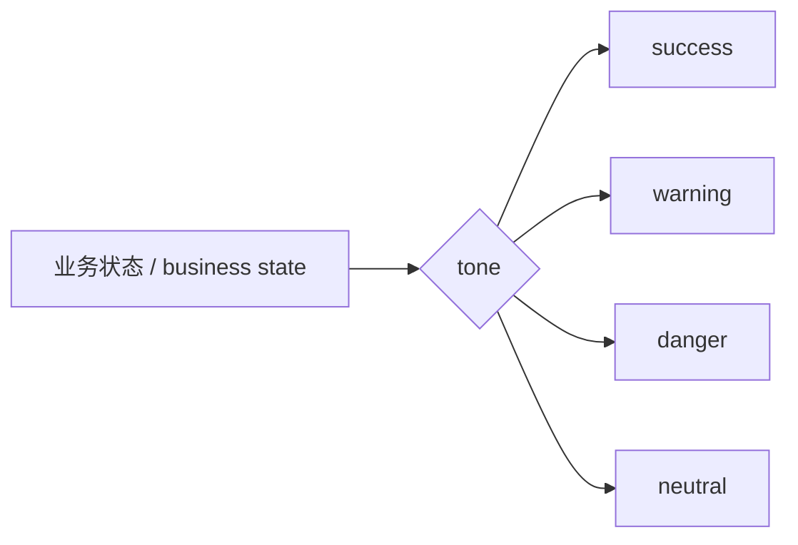

# Badge 标签

## 用途 / Purpose

`Badge` 用于表达项目、文档或任务的短状态，例如 `On track`、`Needs review`、`Critical`。它是内联展示组件，不负责状态计算或状态流转。

`Badge` communicates short project, document, or task states such as `On track`, `Needs review`, and `Critical`. It is an inline display component; state calculation and transitions belong to the host.

## 安装与导入 / Install and import

```bash
pnpm add infisson_ui
```

```tsx
import { Badge } from "infisson_ui";
import "infisson_ui/styles.css";
```

## Props

| Prop | Type | Default | 中文说明 / English |
| --- | --- | --- | --- |
| `tone` | `"neutral" \| "brand" \| "success" \| "warning" \| "danger"` | `"neutral"` | 语义色调 / semantic tone |
| `size` | `"sm" \| "md"` | `"md"` | 标签尺寸 / badge size |
| `dot` | `boolean` | `false` | 显示装饰圆点 / show a decorative dot |
| `children` | `ReactNode` | required | 标签内容 / badge content |
| 其他 / other | `HTMLAttributes<HTMLSpanElement>` | — | 原生 span 属性 / native span attributes |

## 基本调用 / Basic usage

```tsx
export function ProjectStatus() {
  return (
    <div data-infisson style={{ display: "flex", gap: 8 }}>
      <Badge tone="success" dot>On track / 进行中</Badge>
      <Badge tone="warning">Needs review / 待审核</Badge>
      <Badge tone="danger" size="sm">Critical / 严重</Badge>
    </div>
  );
}
```

状态文案应短而稳定。如果标签本身可点击，请在外层使用按钮或链接，不要把交互伪装成 `span`。

Keep status labels short and stable. If a badge is interactive, wrap it with a button or link instead of pretending a `span` is interactive.

## 状态、边界与无障碍 / States, edge cases, and accessibility

- `dot` 只是装饰，已设置 `aria-hidden`，不会重复读屏文案。
- 不要只用颜色区分状态；应同时提供文字。
- 长文本会跟随宿主布局换行，列表中应限制文案长度。
- `tone` 仅表达语义，不代表业务权限。

- The dot is decorative and `aria-hidden`, so it is not announced twice.
- Never rely on color alone; always provide text.
- Long content follows host layout and may wrap; constrain label length in dense lists.
- `tone` expresses meaning, not business authorization.

## 主题与配图 / Theme and visual reference

```css
[data-infisson] {
  --inf-success: #b8f52d;
  --inf-warning: #ffad1f;
  --inf-danger: #ff5a4f;
}
```


图中项目浏览区展示了多种状态标签并列时的密度、圆角和对比度关系。

The project browsing area demonstrates density, radius, and contrast when several status badges appear together.


