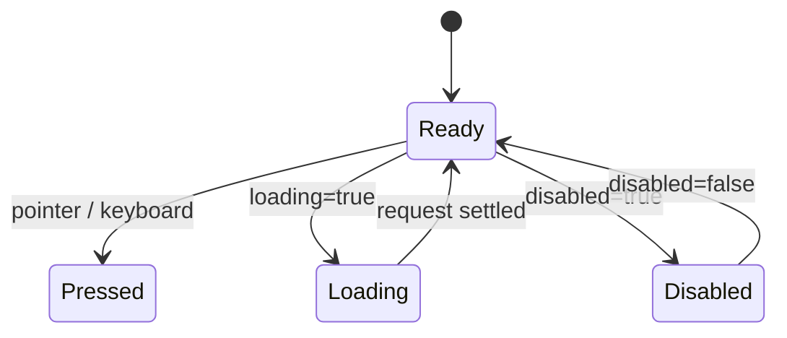

# Button 按钮

## 用途 / Purpose

`Button` 是带有品牌、深色、描边、幽灵和危险语义的通用操作按钮。它只负责按钮语义和交互状态，不包含路由、请求、权限或业务数据。

`Button` is the reusable action control with brand, dark, outline, ghost, and danger semantics. It owns button semantics and interaction states; routing, requests, permissions, and business data stay in the host application.

## 安装与导入 / Install and import

```bash
pnpm add infisson_ui
```

```tsx
import { Button } from "infisson_ui";
import "infisson_ui/styles.css";
```

## Props

| Prop | Type | Default | 中文说明 / English |
| --- | --- | --- | --- |
| `variant` | `"brand" \| "dark" \| "outline" \| "ghost" \| "danger"` | `"brand"` | 语义和视觉变体 / semantic and visual variant |
| `size` | `"sm" \| "md" \| "lg"` | `"md"` | 尺寸 / size |
| `loading` | `boolean` | `false` | 显示加载态并阻止重复点击 / shows loading and prevents duplicate clicks |
| `disabled` | `boolean` | `false` | 原生禁用状态 / native disabled state |
| `className` | `string` | — | 追加类名 / additional class names |
| 其他 / other | `ButtonHTMLAttributes<HTMLButtonElement>` | — | 原生按钮属性都会透传 / native button attributes are forwarded |

## 基本调用 / Basic usage

```tsx
export function ProjectActions() {
  return (
    <div data-infisson style={{ display: "flex", gap: 12 }}>
      <Button variant="brand" onClick={() => console.log("open")}>打开项目 / Open project</Button>
      <Button variant="outline" size="sm">查看详情 / View details</Button>
      <Button variant="danger">删除 / Delete</Button>
    </div>
  );
}
```

异步动作必须在请求期间传入 `loading`，组件会自动设置 `aria-busy` 并禁用按钮；请求失败后由宿主恢复 `loading={false}` 并显示错误。

For async actions, pass `loading` while the request is pending. The component sets `aria-busy` and disables itself; the host restores `loading={false}` and owns error presentation.

```tsx
const [saving, setSaving] = useState(false);

async function save() {
  setSaving(true);
  try { await persistProject(); }
  finally { setSaving(false); }
}

<Button type="submit" loading={saving}>保存 / Save</Button>;
```

## 状态、边界与无障碍 / States, edge cases, and accessibility

- `disabled` 和 `loading` 都会阻止点击；`loading` 仍保留按钮文本，避免布局跳动。
- 使用 `type="submit"` 或 `type="button"` 明确表单语义；组件不会偷偷提交表单。
- 文本应描述动作；图标按钮必须提供 `aria-label`。
- 颜色不是唯一状态信号；危险按钮仍应有明确文字。
- `prefers-reduced-motion: reduce` 下不会执行旋转动画。

- Both `disabled` and `loading` prevent clicks; loading keeps the label to avoid layout shift.
- Set `type="submit"` or `type="button"` explicitly; the component never silently submits a form.
- Use action-oriented labels; icon-only buttons must provide `aria-label`.
- Color is not the only status signal; danger actions still need explicit text.
- The spinner animation is disabled when `prefers-reduced-motion: reduce` is active.

## 主题与配图 / Theme and visual reference

组件样式使用 `--inf-*` 变量，可在局部根节点覆盖：

The component uses `--inf-*` tokens and can be themed at a local root:

```css
[data-infisson="dark"] {
  --inf-brand: #c7ff39;
  --inf-text: #f7f8fb;
  --inf-surface: #171920;
}
```


上图的顶部控制区展示了主操作按钮、次操作按钮、深色操作按钮和状态标签的组合关系；它是视觉参考，不是组件测试快照。

The global controls area above shows the relationship between primary, secondary, dark actions, and status labels. It is a visual reference, not a test snapshot.


