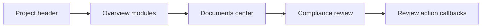

# 项目详情组件帮助 / Project detail component help

图 02 的 B01–B28 组件均有独立的中英文帮助文件。每份文件包含安装与导入、Props、可复制的 React 调用示例、状态与边界、无障碍说明，并引用图 02 作为视觉基线。实际组件只读取 Props，不读取固定项目数据或外部服务。

Every B01–B28 component from reference 02 has its own bilingual help file. Each file covers installation and import, Props, a copyable React example, states and edge cases, accessibility, and the reference image. Components receive data through Props and do not call project APIs.

## B01–B12 项目概览 / Project overview

| ID | 组件 / Component | Help |
| --- | --- | --- |
| B01 | ProjectBreadcrumb | [project-breadcrumb.zh-en.md](project-breadcrumb.zh-en.md) |
| B02 | ProjectIdChip | [project-id-chip.zh-en.md](project-id-chip.zh-en.md) |
| B03 | ProjectTabs | [project-tabs.zh-en.md](project-tabs.zh-en.md) |
| B04 | ProjectHeaderActions | [project-header-actions.zh-en.md](project-header-actions.zh-en.md) |
| B05 | ProjectStatusBadge | [project-status-badge.zh-en.md](project-status-badge.zh-en.md) |
| B06 | PermitProgressCard | [permit-progress-card.zh-en.md](permit-progress-card.zh-en.md) |
| B07 | ProjectAIStatusCard | [project-ai-status-card.zh-en.md](project-ai-status-card.zh-en.md) |
| B08 | RequirementsSummary | [requirements-summary.zh-en.md](requirements-summary.zh-en.md) |
| B09 | ActivityFeed | [activity-feed.zh-en.md](activity-feed.zh-en.md) |
| B10 | ProjectDetailsCard | [project-details-card.zh-en.md](project-details-card.zh-en.md) |
| B11 | ProjectTeamCard | [project-team-card.zh-en.md](project-team-card.zh-en.md) |
| B12 | InspectionScheduleCard | [inspection-schedule-card.zh-en.md](inspection-schedule-card.zh-en.md) |

## B13–B20 文档中心 / Documents center

| ID | 组件 / Component | Help |
| --- | --- | --- |
| B13 | DocumentCategoryTabs | [document-category-tabs.zh-en.md](document-category-tabs.zh-en.md) |
| B14 | DocumentStatusFilter | [document-status-filter.zh-en.md](document-status-filter.zh-en.md) |
| B15 | DocumentSearch | [document-search.zh-en.md](document-search.zh-en.md) |
| B16 | AICheckSummary | [ai-check-summary.zh-en.md](ai-check-summary.zh-en.md) |
| B17 | DocumentGroup | [document-group.zh-en.md](document-group.zh-en.md) |
| B18 | DocumentRow | [document-row.zh-en.md](document-row.zh-en.md) |
| B19 | FileUploadDropzone | [file-upload-dropzone.zh-en.md](file-upload-dropzone.zh-en.md) |
| B20 | DocumentIntelligencePanel | [document-intelligence-panel.zh-en.md](document-intelligence-panel.zh-en.md) |

## B21–B28 合规审查 / Compliance review

| ID | 组件 / Component | Help |
| --- | --- | --- |
| B21 | ComplianceScoreCard | [compliance-score-card.zh-en.md](compliance-score-card.zh-en.md) |
| B22 | ComplianceFindingsList | [compliance-findings-list.zh-en.md](compliance-findings-list.zh-en.md) |
| B23 | FindingDetailPanel | [finding-detail-panel.zh-en.md](finding-detail-panel.zh-en.md) |
| B24 | RequirementSourcesPanel | [requirement-sources-panel.zh-en.md](requirement-sources-panel.zh-en.md) |
| B25 | RecommendedActionCard | [recommended-action-card.zh-en.md](recommended-action-card.zh-en.md) |
| B26 | AIFixDiffPanel | [ai-fix-diff-panel.zh-en.md](ai-fix-diff-panel.zh-en.md) |
| B27 | ReviewActionBar | [review-action-bar.zh-en.md](review-action-bar.zh-en.md) |
| B28 | ReviewStatusPills | [review-status-pills.zh-en.md](review-status-pills.zh-en.md) |

