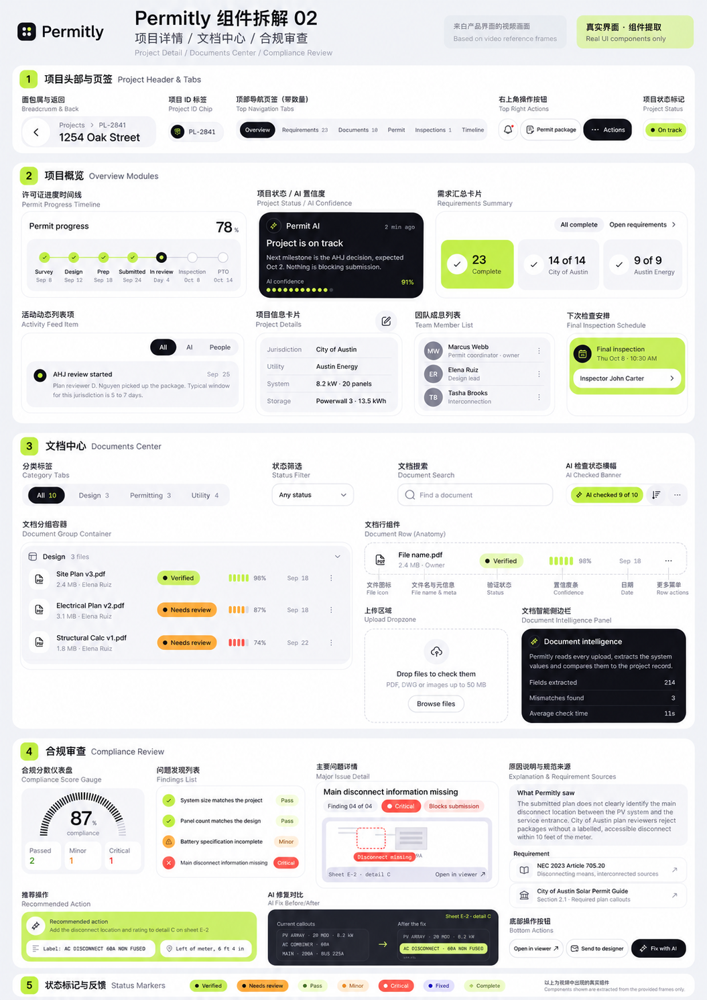
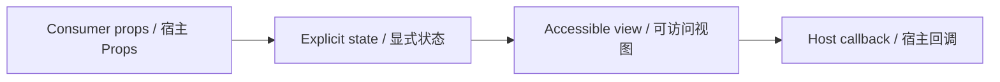

# ComplianceScoreCard / ComplianceScoreCard

> Reference ID: **B21** · 04 · 合规分数

## 用途 / Purpose

`ComplianceScoreCard` is the reusable infission component mapped to `B21` in the reference board. It receives data through props and leaves routing, networking, permissions, payments, and business state to the consumer.

`ComplianceScoreCard` 是 `B21` 对应的可复用 infission 组件。组件通过 Props 接收数据并展示状态；路由、网络、权限、支付和业务状态由宿主项目负责。

## 安装与导入 / Install and import

```bash
pnpm add infisson_ui
```

```tsx
import { ComplianceScoreCard } from "infisson_ui";
import "infisson_ui/styles.css";
```

## Props / 属性

| Prop | Type | 中文说明 / English |
|---|---|---|
| `score` | `number` | Compliance percentage; values are clamped to 0–100 and non-finite values render as no data. / 合规百分比；限制在 0–100，非有限值显示为无数据。 |
| `passed` | `number` | Passed finding count. / 通过问题数量。 |
| `minor` | `number` | Minor finding count. / 一般问题数量。 |
| `critical` | `number` | Critical finding count. / 严重问题数量。 |
| `title` | `string` | Heading and accessible gauge label; defaults to `Compliance`. / 标题和仪表可访问标签，默认为 `Compliance`。 |
| `interactive` | `boolean` | Enables pointer/keyboard score adjustment; defaults to `false`. / 启用鼠标拖动与键盘调整，默认为 `false`。 |
| `onChange?` | `(score: number) => void` | Controlled score callback; host writes it back to `score`. / 受控分数回调，宿主需回写 `score`。 |
| `step` | `number` | Adjustment step; defaults to `1`. / 调整步长，默认为 `1`。 |
| `className` + native section props | `string` + `HTMLAttributes<HTMLElement>` | Root styling and semantics. / 根节点样式和语义。 |

`dist/index.d.ts` 是发布包的权威声明；组件变体沿用同一 Props 契约。/ `dist/index.d.ts` is the authoritative declaration shipped with the package; visual variants use the same Props contract.

## 可复制调用 / Copyable usage

```tsx
export function ComplianceScoreCardExample() {
  return (
    <section data-infisson aria-label="ComplianceScoreCard example">
      <ComplianceScoreCard score={87} passed={2} minor={1} critical={1} className="example-compliancescorecard" />
    </section>
  );
}
```

```tsx
function EditableComplianceCard() {
  const [score, setScore] = useState(87);
  return <ComplianceScoreCard score={score} interactive onChange={setScore} passed={2} minor={1} critical={1} />;
}
```

For components with required data, pass the required fields listed above; callbacks remain owned by the host application. / 如果组件需要必填数据，请按上表传入；回调由宿主应用负责。

## 状态与边界 / States and edge cases

- Default, hover, focus-visible, active/selected, disabled, loading, error, and empty states are explicit where supported by the component Props.
- Missing or unknown data stays visible as an empty or pending state; it must not be represented as a successful result.
- Long labels, zero values, missing media, duplicate clicks, and narrow viewports are handled without breaking the surrounding layout.
- State changes are interruptible, and callbacks are not fired twice for one user action.

- 默认、悬停、可见焦点、激活/选中、禁用、加载、错误和空状态按组件 Props 显式表达。
- 缺失或未知数据保持为空或待处理状态，不能伪装成成功。
- 长标签、零值、缺少图片、重复点击和窄视口不能破坏布局。
- 状态切换可中断，一次用户动作不会重复触发回调。

## 无障碍 / Accessibility

- Keep native semantics and visible labels; color alone never communicates state.
- Interactive elements are keyboard reachable and show a visible `:focus-visible` indicator.
- Important updates use an appropriate status or live region; decorative icons are hidden from assistive technology.
- `prefers-reduced-motion: reduce` disables non-essential movement.

- 保留原生语义和可见标签，不能只依赖颜色表达状态。
- 交互元素可用键盘访问，并显示清晰的 `:focus-visible` 焦点指示。
- 重要更新使用合适的 status 或 live region，装饰图标对辅助技术隐藏。
- `prefers-reduced-motion: reduce` 会关闭非必要动效。

## 主题与配图 / Theme and visual reference

```css
[data-infisson] {
  --inf-color-brand: #c5f33e;
  --inf-color-surface-inverse: #111214;
}
```



图片是静态范围基线；视频中未逐帧确认的行为会标为 `implementation-proposal`。The image is the static scope baseline; motion not verified frame-by-frame remains `implementation-proposal`.


