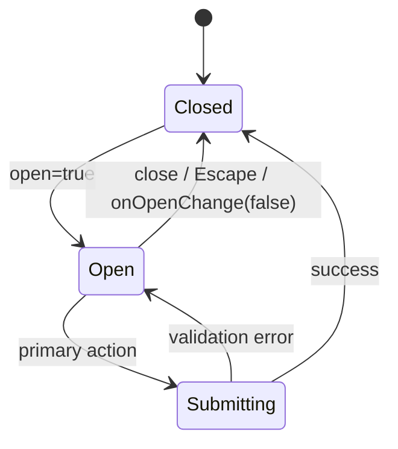

# Dialog 弹窗

## 用途 / Purpose

`Dialog` 是受控的原生 `<dialog>` 弹窗，提供标题、描述、内容、操作区、遮罩和关闭回调。业务确认、支付、提交等动作由宿主通过 `actions` 注入。

`Dialog` is a controlled native `<dialog>` with title, description, content, actions, backdrop, and close callbacks. The host supplies business confirmation, payment, or submission actions through `actions`.

## 安装与导入 / Install and import

```bash
pnpm add infisson_ui
```

```tsx
import { Button, Dialog } from "infisson_ui";
import "infisson_ui/styles.css";
```

## Props

| Prop | Type | Default | 中文说明 / English |
| --- | --- | --- | --- |
| `open` | `boolean` | required | 是否打开 / visibility |
| `onOpenChange` | `(open: boolean) => void` | required | 打开状态回调 / visibility callback |
| `title` | `string` | required | 弹窗标题 / accessible title |
| `description` | `string` | — | 标题下的辅助说明 / supporting description |
| `children` | `ReactNode` | — | 主体内容 / body content |
| `actions` | `ReactNode` | — | 底部操作区 / action area |
| `className` | `string` | — | 追加类名 / additional class names |

## 基本调用 / Basic usage

```tsx
export function ReviewDialog() {
  const [open, setOpen] = useState(false);
  return (
    <div data-infisson>
      <Button onClick={() => setOpen(true)}>审核 / Review</Button>
      <Dialog
        open={open}
        onOpenChange={setOpen}
        title="Review permit package"
        description="Check the outstanding findings before submitting."
        actions={
          <>
            <Button variant="ghost" onClick={() => setOpen(false)}>取消 / Cancel</Button>
            <Button onClick={() => { submitPackage(); setOpen(false); }}>提交 / Submit</Button>
          </>
        }
      >
        <p>There are 3 findings that need your attention.</p>
      </Dialog>
    </div>
  );
}
```

## 状态、关闭和无障碍 / States, closing, and accessibility

- `open` 是唯一可见性来源；关闭按钮、Esc 和宿主操作都通过 `onOpenChange(false)` 汇合。
- 标题是必填的，用于 `aria-labelledby`；有 `description` 时自动关联 `aria-describedby`。
- 不要把不可逆动作放在唯一按钮上；危险操作应使用 `variant="danger"` 并在文案中说明后果。
- 弹窗内的焦点管理由原生 `<dialog>` 负责；宿主应避免在弹窗打开时卸载触发器所在的页面区域。

- `open` is the single visibility source; the close button, Escape, and host actions converge on `onOpenChange(false)`.
- The title is required for `aria-labelledby`; `description` is automatically connected with `aria-describedby`.
- Do not make an irreversible action the only button; use `variant="danger"` and describe the consequence.
- Native `<dialog>` owns focus behavior; the host should avoid unmounting the trigger region while the dialog is open.

## 主题与配图 / Theme and visual reference


图左侧的 AI 修复确认弹窗展示了标题、变更列表、复选框和取消 / 确认操作区的层级关系。

The AI fix confirmation modal on the left shows the hierarchy of title, change list, checkboxes, and cancel/confirm actions.


