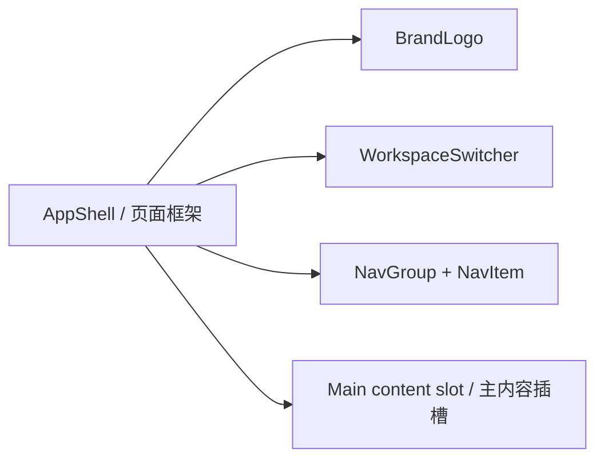

# AppShell / AppShell

> Supporting composition for A01–A08 · 页面框架组合组件

## 用途 / Purpose

`AppShell` composes `BrandLogo`, `WorkspaceSwitcher`, `NavGroup`, `NavItem`, `SidebarAIWidget`, and `UserProfileCard` into the reusable sidebar-plus-content layout shown by the first reference board. It owns layout and explicit sidebar state only; routing, permissions, networking, and business data remain in the host application.

`AppShell` 将 `BrandLogo`、`WorkspaceSwitcher`、`NavGroup`、`NavItem`、`SidebarAIWidget` 与 `UserProfileCard` 组合成第一张参考图中的侧栏加内容布局。它只负责布局和明确的侧栏状态；路由、权限、网络和业务数据仍由宿主应用负责。

## 安装与导入 / Install and import

```bash
pnpm add infisson_ui
```

```tsx
import { AppShell } from "infisson_ui";
import "infisson_ui/styles.css";
```

## Props / 属性

| Prop | Type | 中文说明 / English |
|---|---|---|
| `brand?` | `BrandLogoProps` | 品牌参数 / Brand configuration |
| `workspace` | `WorkspaceOption` | 当前工作区 / Current workspace |
| `workspaceOptions?` | `WorkspaceOption[]` | 可切换工作区 / Workspace choices |
| `onWorkspaceChange?` | `(workspace: WorkspaceOption) => void` | 工作区切换回调；宿主应把返回值写回 `workspace` / Workspace selection callback; the host should write the selected value back to `workspace` |
| `navGroups` | `AppShellNavGroup[]` | 分组导航数据；每项需要稳定 `id` / Grouped navigation with stable item IDs |
| `activeItem?` | `string` | 当前导航项 ID / Active navigation item ID |
| `onNavigate?` | `(item: AppShellNavItem) => void` | 导航回调 / Navigation callback |
| `aiWidget?` | `SidebarAIWidgetProps` | 可选 AI 侧栏配置 / Optional AI widget configuration |
| `user?` | `UserProfileCardProps` | 可选用户区配置 / Optional user profile configuration |
| `sidebarOpen?` | `boolean` | 受控展开状态 / Controlled open state |
| `defaultSidebarOpen?` | `boolean` | 非受控初始状态，默认展开 / Uncontrolled initial state, defaults open |
| `onSidebarOpenChange?` | `(open: boolean) => void` | 折叠按钮回调 / Sidebar toggle callback |
| `children` | `ReactNode` | 主内容插槽 / Main content slot |
| `className?` | `string` | 自定义 class 名 / Optional custom class name |

## 可复制调用 / Copyable usage

```tsx
import { AppShell } from "infisson_ui";
import "infisson_ui/styles.css";

const groups = [
  { id: "main", items: [{ id: "overview", label: "Overview" }, { id: "projects", label: "Projects", count: 128 }] },
  { id: "permitting", label: "PERMITTING", items: [{ id: "permits", label: "Permits", count: 47 }] },
  { id: "workspace", label: "WORKSPACE", items: [{ id: "settings", label: "Settings" }] },
];

export function DashboardFrame() {
  return <AppShell workspace={{ id: "northstar", name: "Northstar Works", location: "Nova Ridge, NR" }} navGroups={groups} activeItem="projects" onNavigate={(item) => console.log(item.id)}><h1>Projects</h1></AppShell>;
}
```

The component reuses the same primitive contracts as the standalone components. A group label is non-interactive; navigation items emit the supplied item; collapse can be controlled or uncontrolled. / 组件复用各独立组件的契约。分组标题不可交互；导航项回调返回传入的 item；折叠状态支持受控和非受控两种模式。

## 状态与边界 / States and edge cases

- Expanded and collapsed sidebar states are explicit. Empty `navGroups` leaves the content slot usable; missing `aiWidget` or `user` omits those regions.
- Stable IDs are required for React keys and navigation callbacks. AppShell does not invent routes when an item has no `href`.
- Narrow viewports stack the sidebar above main content; the collapsed state keeps the expand control reachable.

- 展开和折叠状态有明确表达。`navGroups` 为空时主内容仍可用；没有 `aiWidget` 或 `user` 时隐藏对应区域。
- 需要稳定 ID 作为 React key 和导航回调标识。没有 `href` 时 AppShell 不虚构路由。
- 窄屏会把侧栏堆叠到主内容上方；折叠后仍保留可操作的展开按钮。

## 无障碍 / Accessibility

- Uses `aside`, `nav`, and `main` landmarks with visible labels.
- The collapse control has an accessible name and pressed state; navigation items preserve native button/link semantics.
- Child components retain their own focus, menu, switch, and profile semantics.

- 使用带可见名称的 `aside`、`nav` 和 `main` 地标。
- 折叠按钮有无障碍名称和按下状态；导航项保持原生 button/link 语义。
- 子组件保留自身的焦点、菜单、开关和用户信息语义。

## 主题与配图 / Theme and visual reference

```css
[data-infisson] {
  --inf-color-surface: #ffffff;
  --inf-color-surface-muted: #f4f6f8;
  --inf-color-surface-inverse: #111214;
  --inf-color-brand: #c5f33e;
}
```





