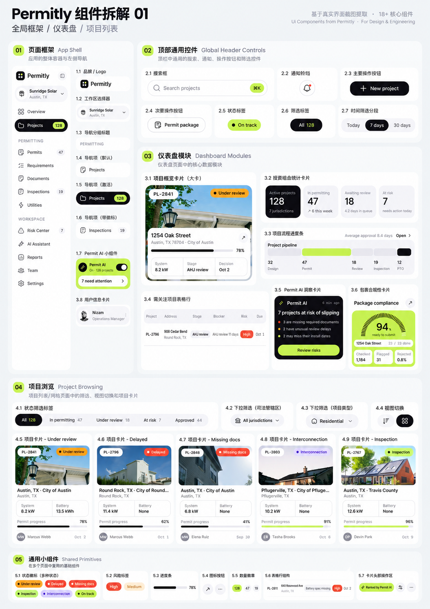
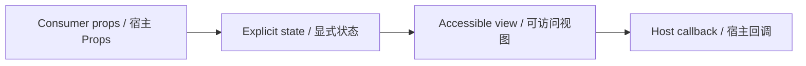

# Button · dark / DarkActionButton

> Reference ID: **A11** · 02 · 2.3

## 用途 / Purpose

`DarkActionButton` is the reusable infission component mapped to `A11` in the reference board. It receives data through props and leaves routing, networking, permissions, payments, and business state to the consumer.

`DarkActionButton` 是 `A11` 对应的可复用 infission 组件。组件通过 Props 接收数据并展示状态；路由、网络、权限、支付和业务状态由宿主项目负责。

## 安装与导入 / Install and import

```bash
pnpm add infisson_ui
```

```tsx
import { DarkActionButton } from "infisson_ui";
import "infisson_ui/styles.css";
```

## Props / 属性

| Prop | Type | 中文说明 / English |
|---|---|---|
| `children` | `ReactNode` | 必填按钮内容 / Required button content |
| `size?` | `"sm" \| "md" \| "lg"` | 尺寸，默认 `md` / Size, defaults to `md` |
| `loading?` | `boolean` | 显示加载指示并自动禁用 / Shows loading indicator and disables the button |
| `disabled?` | `boolean` | 禁用按钮 / Disables the button |
| `type?` | `"button" \| "submit" \| "reset"` | 原生按钮类型 / Native button type |
| `onClick?` | `MouseEventHandler<HTMLButtonElement>` | 点击回调 / Click callback |
| `className?` | `string` | 自定义 class 名 / Optional custom class name |
| `aria-*`, `name`, `value`, `form`, ... | `ButtonHTMLAttributes<HTMLButtonElement>` | 其余原生 button 属性完整透传 / All other native button attributes are forwarded |

`dist/index.d.ts` 是发布包的权威声明；组件变体沿用同一 Props 契约。/ `dist/index.d.ts` is the authoritative declaration shipped with the package; visual variants use the same Props contract.

## 可复制调用 / Copyable usage

```tsx
import { useState } from "react";

export function DarkActionButtonExample() {
  const [saved, setSaved] = useState(false);
  return (
    <section data-infisson aria-label="DarkActionButton example">
      <DarkActionButton onClick={() => setSaved(true)} className="example-button-dark">
        {saved ? "Created" : "New project"}
      </DarkActionButton>
    </section>
  );
}
```

`DarkActionButton` fixes the dark visual variant while preserving the native button contract. The callback should update host state; the component does not create projects or call an API. / `DarkActionButton` 固定深色视觉变体，同时保留原生 button 契约。回调应更新宿主状态，组件不会创建项目或调用接口。

## 状态与边界 / States and edge cases

- Default, hover, focus-visible, pressed, disabled, and loading states are supported. `loading` wins over `disabled` visually and prevents duplicate activation; the host owns success and error feedback.
- Missing or unknown data stays visible as an empty or pending state; it must not be represented as a successful result.
- Long labels, zero values, missing media, duplicate clicks, and narrow viewports are handled without breaking the surrounding layout.
- State changes are interruptible, and callbacks are not fired twice for one user action.

- 支持默认、悬停、可见焦点、按下、禁用和加载状态。`loading` 会显示加载状态并阻止重复激活；成功和错误反馈由宿主管理。
- 缺失或未知数据保持为空或待处理状态，不能伪装成成功。
- 长标签、零值、缺少图片、重复点击和窄视口不能破坏布局。
- 状态切换可中断，一次用户动作不会重复触发回调。

## 无障碍 / Accessibility

- Keep native semantics and visible labels; color alone never communicates state.
- Interactive elements are keyboard reachable and show a visible `:focus-visible` indicator.
- Important updates use an appropriate status or live region; decorative icons are hidden from assistive technology.
- `prefers-reduced-motion: reduce` disables non-essential movement.

- 保留原生语义和可见标签，不能只依赖颜色表达状态。
- 交互元素可用键盘访问，并显示清晰的 `:focus-visible` 焦点指示。
- 重要更新使用合适的 status 或 live region，装饰图标对辅助技术隐藏。
- `prefers-reduced-motion: reduce` 会关闭非必要动效。

## 主题与配图 / Theme and visual reference

```css
[data-infisson] {
  --inf-color-brand: #c5f33e;
  --inf-color-surface-inverse: #111214;
}
```



图片是静态范围基线；视频中未逐帧确认的行为会标为 `implementation-proposal`。The image is the static scope baseline; motion not verified frame-by-frame remains `implementation-proposal`.


