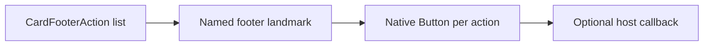

# CardFooterActions / CardFooterActions

> Reference ID: **A37** · 05 · 5.7 · image-confirmed; callbacks and async state are host-controlled

## 用途 / Purpose

`CardFooterActions` renders a labelled footer of button actions for a card. Each action is a real `Button`; callbacks, disabled state, loading state, and any side effects remain with the host application.

`CardFooterActions` 在卡片底部渲染一组带名称的按钮操作。每个操作都是真实的 `Button`；回调、禁用、加载和副作用由宿主应用负责。

## 安装与导入 / Install and import

```bash
pnpm add infisson_ui
```

```tsx
import { CardFooterActions } from "infisson_ui";
import "infisson_ui/styles.css";
```

## Props / 属性

| Prop | Type | Required | 中文说明 / English |
|---|---|---:|---|
| `actions` | `CardFooterAction[]` (`{ id: string; label: string; icon?: ReactNode; variant?: ButtonVariant; onClick?: () => void; disabled?: boolean; loading?: boolean }`) | Yes | 按顺序显示的操作；ordered footer actions |
| `ariaLabel` | `string` | No | 页脚操作组名称，默认 `Card actions`；accessible footer name |
| `className` | `string` | No | 附加 CSS 类名；additional class name |

## 可复制调用 / Copyable usage

```tsx
import { CardFooterActions } from "infisson_ui";

export function PermitCardFooter() {
  return <CardFooterActions ariaLabel="Permit actions" actions={[{ id: "open", label: "Open project", variant: "outline", onClick: () => console.log("open") }, { id: "review", label: "Review risks", variant: "brand", onClick: () => console.log("review") }]} />;
}
```

## 状态与边界 / States and edge cases

- Each action receives `type="button"`, so it will not submit a surrounding form accidentally.
- `disabled` prevents activation; `loading` disables the button and exposes `aria-busy` through the shared `Button`.
- An empty action list renders an empty labelled footer. Avoid duplicate `id` values because they are used as React keys.
- An action without `onClick` is displayable but has no host behavior; connect a callback or mark it disabled when unavailable.

- 每个操作都接收 `type="button"`，不会意外提交外层表单。
- `disabled` 阻止激活；`loading` 禁用按钮，并通过统一 `Button` 暴露 `aria-busy`。
- 操作数组为空时显示空的已命名页脚；应避免重复 `id`，因为它们作为 React key。
- 没有 `onClick` 的操作可以展示但没有宿主行为；不可用时请接入回调或标记禁用。

## 无障碍 / Accessibility

- The footer has a landmark name and each action uses the shared native button semantics.
- Keep `label` action-oriented and visible; icons are supplementary and should not be the only name.
- Loading and disabled states are exposed by native disabled semantics and `aria-busy`; keyboard focus remains predictable.

- 页脚有地标名称，每个操作都使用统一原生按钮语义。
- `label` 应是可见且面向动作的文案；图标只是补充，不能成为唯一名称。
- 加载和禁用状态通过原生 disabled 与 `aria-busy` 表达，键盘焦点顺序保持可预测。

## 主题与配图 / Theme and visual reference

```css
[data-infisson] {
  --inf-color-brand: #c5f33e;
  --inf-color-surface-inverse: #111214;
  --inf-radius-control: 999px;
}
```


The image confirms the static footer action arrangement; async outcomes are owned by the host and are not claimed as video-confirmed. / 参考图确认静态页脚操作排列；异步结果由宿主负责，不宣称已被视频确认。


