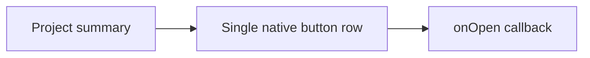

# CompactProjectRow / CompactProjectRow

> Reference ID: **A36** · 05 · 5.6 · image-confirmed; row activation is host-controlled

## 用途 / Purpose

`CompactProjectRow` presents a dense project summary for attention lists. The entire native button row invokes `onOpen`; it does not know routing, project data fetching, or permission rules.

`CompactProjectRow` 用于需要关注列表中的紧凑项目摘要。整行原生按钮调用 `onOpen`；组件不负责路由、项目数据请求或权限规则。

## 安装与导入 / Install and import

```bash
pnpm add infisson_ui
```

```tsx
import { CompactProjectRow, type CompactProjectRowProps } from "infisson_ui";
import "infisson_ui/styles.css";
```

## Props / 属性

| Prop | Type | Required | 中文说明 / English |
|---|---|---:|---|
| `project` | `Pick<ProjectCardData, "id" \| "title" \| "address" \| "status" \| "due"> & { blocker?: string; risk?: "high" \| "medium" \| "low" }` | Yes | 项目摘要数据；project summary data |
| `onOpen` | `() => void` | No | 点击整行时回调；row activation callback |
| `className` | `string` | No | 附加 CSS 类名；additional class name |

## 可复制调用 / Copyable usage

```tsx
import { CompactProjectRow } from "infisson_ui";

export function AttentionRow() {
  return <CompactProjectRow project={{ id: "PL-2841", title: "18 Meridian Way", address: "Nova Ridge, NR", status: "under-review", due: "Oct 2", blocker: "Missing docs", risk: "high" }} onOpen={() => console.log("open project")} />;
}
```

## 状态与边界 / States and edge cases

- The row is a single native button, so the whole summary is one activation target; the trailing arrow is decorative.
- Missing `blocker` or `due` values render an em dash. `risk` defaults to `medium` when omitted.
- `onOpen` is optional for read-only previews; wire it in production when the row should navigate.
- Long project titles and addresses follow the row's responsive grid; avoid embedding another button inside `project` content.

- 整行是单一原生按钮，整个摘要都是一个点击目标，末尾箭头是装饰内容。
- 缺少 `blocker` 或 `due` 时显示破折号；省略 `risk` 时默认为 `medium`。
- `onOpen` 对只读预览是可选的；生产使用中需要导航时请接入。
- 长项目名称和地址遵循行的响应式网格；不要在项目内容中嵌套另一个按钮。

## 无障碍 / Accessibility

- Native button semantics provide keyboard activation and a visible focus target.
- Visible project identifiers, status, risk, blocker, and due text form the accessible name; keep them descriptive.
- Do not add a nested interactive element because nested buttons are invalid and confusing to assistive technology.

- 原生按钮语义提供键盘激活和可见焦点目标。
- 项目标识、状态、风险、阻塞原因和截止日期共同构成可访问名称，应保持描述性。
- 不要再添加嵌套交互元素，嵌套按钮对辅助技术无效且容易混淆。

## 主题与配图 / Theme and visual reference

```css
[data-infisson] {
  --inf-color-surface: #ffffff;
  --inf-color-border: #e3e6ef;
  --inf-radius-card: 1rem;
}
```


The reference confirms the compact row structure; navigation callback behavior is host-controlled and not claimed as video-confirmed. / 参考图确认紧凑行结构；导航回调由宿主控制，不宣称已被视频确认。



