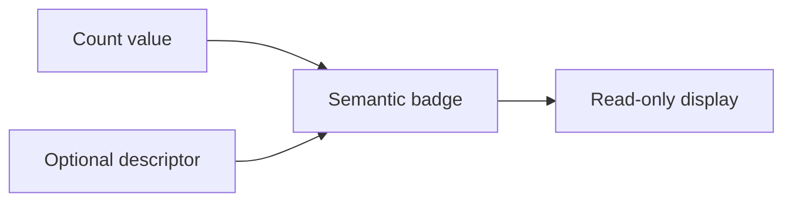

# CountBadge / CountBadge

> Reference ID: **A35** · 05 · 5.5 · image-confirmed; display-only

## 用途 / Purpose

`CountBadge` pairs a compact count with optional descriptive text. It is a read-only marker: filtering, navigation, and refresh behavior belong to the surrounding control.

`CountBadge` 将紧凑数量与可选说明文字组合。它是只读标记；筛选、导航和刷新行为由外层控件负责。

## 安装与导入 / Install and import

```bash
pnpm add infisson_ui
```

```tsx
import { CountBadge } from "infisson_ui";
import "infisson_ui/styles.css";
```

## Props / 属性

| Prop | Type | Required | 中文说明 / English |
|---|---|---:|---|
| `value` | `number \| string` | Yes | 数量或短文本；count or short count label |
| `label` | `string` | No | 数量说明；optional descriptor |
| `tone` | `BadgeTone` (`neutral \| brand \| success \| warning \| danger`) | No | 徽标语义色调，默认 `neutral`；semantic tone |
| `className` | `string` | No | 附加 CSS 类名；additional class name |

## 可复制调用 / Copyable usage

```tsx
import { CountBadge } from "infisson_ui";

export function ProjectCount({ count }: { count: number }) {
  return <CountBadge value={count} label="projects" tone="brand" />;
}
```

## 状态与边界 / States and edge cases

- Numeric zero and string values render as supplied; no implicit hiding or pluralization is applied.
- Very large counts should be formatted by the host (for example `1.2k`) when space is constrained.
- CountBadge has no click, loading, or disabled state. Wrap it in a separately labelled button when the count itself is actionable.
- It does not announce live updates automatically; add a host live region when a changing count matters to users.

- 数字 `0` 和字符串值都会按传入内容显示；组件不会自动隐藏或处理单复数。
- 空间有限时应由宿主格式化大数（例如 `1.2k`）。
- CountBadge 没有点击、加载或禁用状态；数量可操作时请包在独立的已命名按钮内。
- 组件不会自动播报动态更新；需要播报时由宿主添加 live region。

## 无障碍 / Accessibility

- The text remains in the accessibility tree, so pair `value` with a meaningful `label` when the number is ambiguous.
- It renders as a non-interactive span and adds no tab stop.
- Do not communicate severity or state through `tone` alone; keep the descriptor visible.

- 文本保留在辅助技术树中，数字含义不明确时应提供有意义的 `label`。
- 组件是非交互 span，不增加 Tab 停靠点。
- 不能只通过 `tone` 表达严重程度或状态，应保留可见说明。

## 主题与配图 / Theme and visual reference

```css
[data-infisson] {
  --inf-color-brand: #c5f33e;
  --inf-color-text-muted: #737b91;
  --inf-radius-pill: 999px;
}
```


The reference confirms a static count marker; no independent click behavior is claimed. / 参考图确认静态数量标记，不宣称存在独立点击行为。


