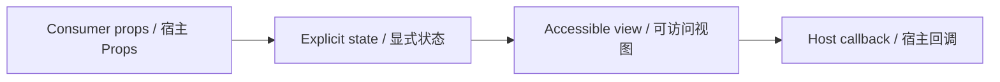

# FilterChip / FilterChip

> Reference ID: **A14** · 02 · 2.6

## 用途 / Purpose

`FilterChip` is the reusable infission component mapped to `A14` in the reference board. It receives data through props and leaves routing, networking, permissions, payments, and business state to the consumer.

`FilterChip` 是 `A14` 对应的可复用 infission 组件。组件通过 Props 接收数据并展示状态；路由、网络、权限、支付和业务状态由宿主项目负责。

## 安装与导入 / Install and import

```bash
pnpm add infisson_ui
```

```tsx
import { FilterChip } from "infisson_ui";
import "infisson_ui/styles.css";
```

## Props / 属性

| Prop | Type | 中文说明 / English |
|---|---|---|
| `label` | `string` | 必填筛选名称 / Required filter label |
| `selected?` | `boolean` | 是否选中，默认 `false`；映射到 `aria-pressed` / Selected state, defaults to `false`; maps to `aria-pressed` |
| `count?` | `number` | 可选数量角标 / Optional count badge |
| `onClick?` | `() => void` | 主筛选按钮点击回调 / Main filter button callback |
| `removable?` | `boolean` | 是否显示独立移除按钮 / Whether to render a separate remove button |
| `onRemove?` | `() => void` | 移除按钮回调 / Remove button callback |
| `className?` | `string` | 自定义 class 名 / Optional custom class name |

`dist/index.d.ts` 是发布包的权威声明；组件变体沿用同一 Props 契约。/ `dist/index.d.ts` is the authoritative declaration shipped with the package; visual variants use the same Props contract.

## 可复制调用 / Copyable usage

```tsx
export function FilterChipExample() {
  return (
    <section data-infisson aria-label="FilterChip example">
      <FilterChip
        label="All"
        count={128}
        selected
        onClick={() => console.log("toggle filter")}
        removable
        onRemove={() => console.log("remove filter")}
        className="example-filterchip"
      />
    </section>
  );
}
```

The main button only emits `onClick`; it does not mutate `selected` by itself, so controlled consumers should update that prop. The remove control is a separate button and calls `onRemove` without invoking the main callback. / 主按钮只触发 `onClick`，不会自行修改 `selected`，受控宿主应更新该属性。移除控件是独立按钮，调用 `onRemove` 时不会触发主回调。

## 状态与边界 / States and edge cases

- Default, hover, focus-visible, selected/not-selected, count present/absent, and removable states are supported. There is no implicit disabled state; the host can omit callbacks or wrap the chip in a disabled control when needed.
- Missing or unknown data stays visible as an empty or pending state; it must not be represented as a successful result.
- Long labels, zero values, missing media, duplicate clicks, and narrow viewports are handled without breaking the surrounding layout.
- State changes are interruptible, and callbacks are not fired twice for one user action.

- 支持默认、悬停、可见焦点、选中/未选中、有无数量和可移除状态。组件没有隐式禁用状态，需要时由宿主不传回调或使用禁用外层控件表达。
- 缺失或未知数据保持为空或待处理状态，不能伪装成成功。
- 长标签、零值、缺少图片、重复点击和窄视口不能破坏布局。
- 状态切换可中断，一次用户动作不会重复触发回调。

## 无障碍 / Accessibility

- Keep native semantics and visible labels; color alone never communicates state.
- Interactive elements are keyboard reachable and show a visible `:focus-visible` indicator.
- Important updates use an appropriate status or live region; decorative icons are hidden from assistive technology.
- `prefers-reduced-motion: reduce` disables non-essential movement.

- 保留原生语义和可见标签，不能只依赖颜色表达状态。
- 交互元素可用键盘访问，并显示清晰的 `:focus-visible` 焦点指示。
- 重要更新使用合适的 status 或 live region，装饰图标对辅助技术隐藏。
- `prefers-reduced-motion: reduce` 会关闭非必要动效。

## 主题与配图 / Theme and visual reference

```css
[data-infisson] {
  --inf-color-brand: #c5f33e;
  --inf-color-surface-inverse: #111214;
}
```


图片是静态范围基线；视频中未逐帧确认的行为会标为 `implementation-proposal`。The image is the static scope baseline; motion not verified frame-by-frame remains `implementation-proposal`.


