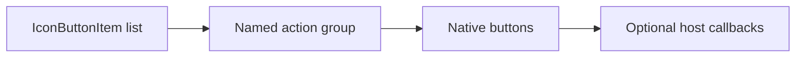

# IconButtonSet / IconButtonSet

> Reference ID: **A34** · 05 · 5.4 · image-confirmed; host actions are implementation-provided

## 用途 / Purpose

`IconButtonSet` groups compact icon actions such as open, share, or more. Each item is a real native button and invokes its own optional callback; the component never supplies navigation or external service behavior.

`IconButtonSet` 将打开、分享、更多等紧凑图标操作组合在一起。每个条目都是原生按钮并调用自己的可选回调；组件不会内置导航或外部服务行为。

## 安装与导入 / Install and import

```bash
pnpm add infisson_ui
```

```tsx
import { IconButtonSet } from "infisson_ui";
import "infisson_ui/styles.css";
```

## Props / 属性

| Prop | Type | Required | 中文说明 / English |
|---|---|---:|---|
| `items` | `IconButtonItem[]` (`{ id: string; label: string; icon?: ReactNode; disabled?: boolean; onClick?: () => void; menuItems?: IconButtonMenuItem[]; menuLabel?: string }`) | Yes | 按顺序显示的操作按钮；optional `menuItems` turns an item into a keyboard-dismissible menu trigger |
| `ariaLabel` | `string` | No | 操作组名称，默认 `Actions`；accessible group label |
| `className` | `string` | No | 附加 CSS 类名；additional class name |

## 可复制调用 / Copyable usage

```tsx
import { IconButtonSet } from "infisson_ui";

export function ProjectActions() {
  return <IconButtonSet ariaLabel="Project actions" items={[{ id: "open", label: "Open project", onClick: () => console.log("open") }, { id: "more", label: "More actions", menuLabel: "Project menu", menuItems: [{ id: "archive", label: "Archive project", onSelect: () => console.log("archive") }] }]} />;
}
```

## 状态与边界 / States and edge cases

- Every item has a visible tooltip (`title`) and an accessible `aria-label`; labels must describe the action, not just the icon shape.
- `disabled` uses native button semantics and suppresses its callback. An empty item list renders an empty named group.
- Items with no `onClick` remain enabled-looking but have no host action; wire a callback or set `disabled` when an action is unavailable.
- When `menuItems` is present, the trigger exposes `aria-haspopup="menu"`, opens a labelled menu, closes on outside pointer or Escape, and restores focus to the trigger.
- The component does not manage pressed or loading state; use a dedicated component when that state is needed.

- 每个条目都有 `title` 和 `aria-label`；标签应描述动作，而不是只描述图标形状。
- `disabled` 使用原生按钮语义并阻止回调。数组为空时显示空的已命名分组。
- 没有 `onClick` 的条目仍会呈现启用外观但不会有宿主行为；不可用时请接入回调或设为 `disabled`。
- 提供 `menuItems` 时，触发按钮会暴露 `aria-haspopup="menu"`，打开已命名菜单，支持外部点击或 Escape 关闭，并把焦点恢复到触发按钮。
- 组件不管理 pressed 或 loading 状态，需要这些状态时使用专用组件。

## 无障碍 / Accessibility

- The wrapper is a labelled `role="group"`; each control is a keyboard-operable native button.
- Do not rely on icon shape or color alone. Supply a unique, action-oriented `label` for every item.
- Menu items are native `role="menuitem"` buttons; Escape closes the menu and restores focus to its trigger.
- Disabled controls remain discoverable but cannot be activated; visible focus styles come from the shared theme.

- 外层是带名称的 `role="group"`，每个控件都是可键盘操作的原生按钮。
- 不能只依赖图标形状或颜色；每个条目都应提供唯一且面向动作的 `label`。
- 菜单项是原生 `role="menuitem"` 按钮；Escape 关闭菜单并将焦点恢复到触发按钮。
- 禁用控件仍可被发现但不能激活；可见焦点样式来自统一主题。

## 主题与配图 / Theme and visual reference

```css
[data-infisson] {
  --inf-color-surface: #ffffff;
  --inf-color-border: #e3e6ef;
  --inf-color-surface-inverse: #111214;
}
```


The reference confirms compact action affordances; callback behavior is provided by the host and is not claimed as video-confirmed. / 参考图确认紧凑操作控件；回调行为由宿主提供，不宣称已被视频确认。


