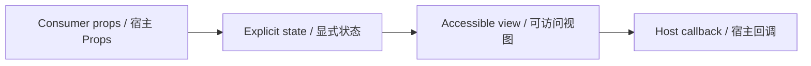

# JurisdictionFilter / JurisdictionFilter

> Reference ID: **A23** · 04 · 4.2

## 用途 / Purpose

`JurisdictionFilter` is the reusable infission component mapped to `A23` in the reference board. It receives data through props and leaves routing, networking, permissions, payments, and business state to the consumer.

`JurisdictionFilter` 是 `A23` 对应的可复用 infission 组件。组件通过 Props 接收数据并展示状态；路由、网络、权限、支付和业务状态由宿主项目负责。

## 安装与导入 / Install and import

```bash
pnpm add infisson_ui
```

```tsx
import { JurisdictionFilter } from "infisson_ui";
import "infisson_ui/styles.css";
```

## Props / 属性

| Prop | Type | 中文说明 / English |
|---|---|---|
| `label?` | `string` | 可见标签与无障碍名称 / Visible label and accessible name |
| `options` | `SelectFilterOption[]` | 业务传入的候选项，每项含 `value` 与 `label` / Business choices with `value` and `label` |
| `icon?` | `ReactNode` | 装饰性前置图标，默认建筑图标 / Decorative leading icon, building icon by default |
| `value?` | `string` | 受控选中值 / Controlled selected value |
| `defaultValue?` | `string` | 非受控初始值 / Initial uncontrolled value |
| `placeholder?` | `string` | 空选择文案 / Empty-selection label |
| `onChange?` | `(value: string) => void` | 选择或清除后调用，清除传空字符串 / Called after selection or clear; clear passes an empty string |
| `onClear?` | `() => void` | 点击显式清除按钮时调用 / Called by the clear button |
| `clearable?` | `boolean` | 选中时是否显示清除按钮，默认 `true` / Show clear button when selected, default `true` |
| `disabled?` | `boolean` | 禁用选择和清除 / Disable selection and clearing |
| `required?` | `boolean` | 原生表单必填状态 / Native required state |
| `name?` | `string` | 原生表单字段名 / Native field name |
| `id?` | `string` | 原生 select 的稳定 id / Stable native select id |
| `className?` | `string` | 自定义根类名 / Custom root class |

`dist/index.d.ts` 是发布包的权威声明；组件变体沿用同一 Props 契约。/ `dist/index.d.ts` is the authoritative declaration shipped with the package; visual variants use the same Props contract.

## 可复制调用 / Copyable usage

```tsx
import { useState } from "react";
import { JurisdictionFilter } from "infisson_ui";
import "infisson_ui/styles.css";
export function JurisdictionFilterExample() {
  const [value, setValue] = useState("");
  return (
    <section data-infisson aria-label="JurisdictionFilter example">
      <JurisdictionFilter
        options={[{ value: "harbor", label: "Harbor County" }, { value: "pine-hollow", label: "Pine Hollow County" }]}
        value={value}
        onChange={setValue}
        onClear={() => setValue("")}
      />
    </section>
  );
}
```

The empty option and the Clear button both call `onChange("")`; combine that value with other project filters in the host query. / 空选项和 Clear 按钮都会调用 `onChange("")`，宿主可将该值与其他项目筛选条件求交集。

## 状态与边界 / States and edge cases

- Empty options remain usable and show only the placeholder; `clearable={false}` removes the explicit clear action.
- Controlled `value` is authoritative; `defaultValue` is only for local uncontrolled state. `disabled` blocks both select and clear.
- Long jurisdiction labels remain native option text and can be localized; an empty value represents no active filter rather than a successful result.
- Selection and clearing each emit one callback for one user action.

- 空候选项仍可用并只显示占位文案；`clearable={false}` 会移除显式清除操作。
- 受控 `value` 为准；`defaultValue` 只用于本地非受控状态；`disabled` 同时阻止选择和清除。
- 长辖区名称保留在原生 option 中并可本地化；空值表示未筛选，不代表成功结果。
- 每次选择或清除只触发一次回调。

## 无障碍 / Accessibility

- Keep native semantics and visible labels; color alone never communicates state.
- Interactive elements are keyboard reachable and show a visible `:focus-visible` indicator.
- Important updates use an appropriate status or live region; decorative icons are hidden from assistive technology.
- `prefers-reduced-motion: reduce` disables non-essential movement.

- 保留原生语义和可见标签，不能只依赖颜色表达状态。
- 交互元素可用键盘访问，并显示清晰的 `:focus-visible` 焦点指示。
- 重要更新使用合适的 status 或 live region，装饰图标对辅助技术隐藏。
- `prefers-reduced-motion: reduce` 会关闭非必要动效。

## 主题与配图 / Theme and visual reference

```css
[data-infisson] {
  --inf-color-brand: #c5f33e;
  --inf-color-surface-inverse: #111214;
}
```


图片是静态范围基线；视频中未逐帧确认的行为会标为 `implementation-proposal`。The image is the static scope baseline; motion not verified frame-by-frame remains `implementation-proposal`.




