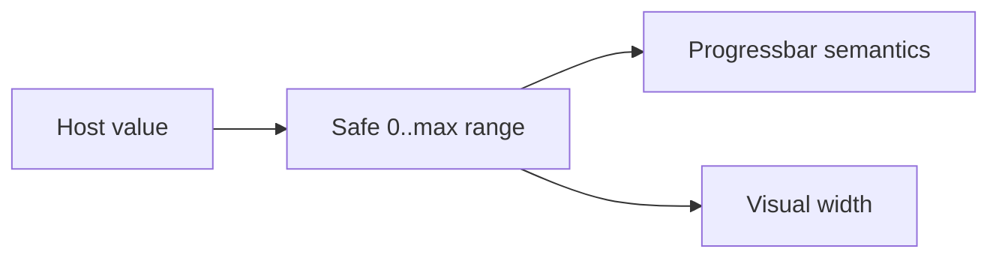

# LinearProgress / LinearProgress

> Reference ID: **A33** · 05 · 5.3 · image-confirmed; display-only

## 用途 / Purpose

`LinearProgress` is a determinate, display-only progress bar. The host owns the value and may update it over time; the component clamps invalid values rather than pretending a result is complete.

`LinearProgress` 是确定型、展示型进度条。进度值由宿主持有并可随时间更新；组件会限制非法值，避免把错误数据伪装成完成。

## 安装与导入 / Install and import

```bash
pnpm add infisson_ui
```

```tsx
import { LinearProgress } from "infisson_ui";
import "infisson_ui/styles.css";
```

## Props / 属性

| Prop | Type | Required | 中文说明 / English |
|---|---|---:|---|
| `value` | `number` | Yes | 当前进度值；current determinate value |
| `max` | `number` | No | 最大值，默认 `100`；positive maximum, defaults to `100` |
| `label` | `string` | No | 进度条可访问名称，默认 `Progress`；accessible label |
| `showValue` | `boolean` | No | 是否显示百分比文字；show the percentage text |
| `className` | `string` | No | 附加 CSS 类名；additional class name |

## 可复制调用 / Copyable usage

```tsx
import { LinearProgress } from "infisson_ui";

export function PermitProgress({ value }: { value: number }) {
  return <LinearProgress label="Permit progress" value={value} max={100} showValue />;
}
```

## 状态与边界 / States and edge cases

- Values below `0`, above `max`, `NaN`, and non-finite values are clamped to a safe determinate range.
- A non-positive or invalid `max` falls back to `100`; no division-by-zero width is emitted.
- The component has no draggable behavior, click action, loading spinner, or error state. Use a separate control for editing a value.
- Updating `value` animates the bar through the shared CSS transition; reduced-motion users receive no non-essential transition.

- 小于 `0`、超过 `max`、`NaN` 或非有限值会被限制到安全的确定范围。
- `max` 非正或非法时回退到 `100`，不会产生除零宽度。
- 组件没有拖动、点击、加载或错误状态；需要编辑值时使用独立控件。
- 更新 `value` 会使用统一 CSS 过渡；减少动效用户不会看到非必要过渡。

## 无障碍 / Accessibility

- The root uses `role="progressbar"` with `aria-valuemin`, `aria-valuemax`, `aria-valuenow`, and a percentage `aria-valuetext`.
- Provide a meaningful `label` when more than one progress bar is present.
- The visible percentage is supplementary and hidden from assistive technology to avoid duplicate announcements.

- 根元素使用 `role="progressbar"`，并提供完整的 `aria-valuemin`、`aria-valuemax`、`aria-valuenow` 和百分比 `aria-valuetext`。
- 页面有多个进度条时，请提供有意义的 `label`。
- 可见百分比是补充内容，对辅助技术隐藏，避免重复播报。

## 主题与配图 / Theme and visual reference

```css
[data-infisson] {
  --inf-color-brand: #c5f33e;
  --inf-color-surface-muted: #f1f2f7;
  --inf-motion-fast: 160ms;
}
```


The image confirms the static progress treatment; timing is a local implementation detail and is not claimed as frame-by-frame video evidence. / 参考图确认静态进度条样式；过渡时长是本地实现细节，不宣称已逐帧视频确认。


