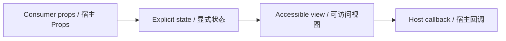

# NotificationButton / NotificationButton

> Reference ID: **A10** · 02 · 2.2

## 用途 / Purpose

`NotificationButton` is the reusable infission component mapped to `A10` in the reference board. It receives data through props and leaves routing, networking, permissions, payments, and business state to the consumer.

`NotificationButton` 是 `A10` 对应的可复用 infission 组件。组件通过 Props 接收数据并展示状态；路由、网络、权限、支付和业务状态由宿主项目负责。

## 安装与导入 / Install and import

```bash
pnpm add infisson_ui
```

```tsx
import { NotificationButton } from "infisson_ui";
import "infisson_ui/styles.css";
```

## Props / 属性

| Prop | Type | 中文说明 / English |
|---|---|---|
| `unreadCount?` | `number` | 未读数量；大于 9 显示 `9+`，零或负数不显示角标 / Unread count; values above 9 show `9+`, zero or negative values hide the badge |
| `label?` | `string` | 按钮的无障碍名称，默认 `Notifications` / Accessible button name, defaults to `Notifications` |
| `onClick?` | `() => void` | 点击或键盘激活时通知宿主打开面板 / Host callback for pointer or keyboard activation |
| `className?` | `string` | 自定义 class 名 / Optional custom class name |

`dist/index.d.ts` 是发布包的权威声明；组件变体沿用同一 Props 契约。/ `dist/index.d.ts` is the authoritative declaration shipped with the package; visual variants use the same Props contract.

## 可复制调用 / Copyable usage

```tsx
export function NotificationButtonExample() {
  return (
    <section data-infisson aria-label="NotificationButton example">
      <NotificationButton
        unreadCount={3}
        label="Project notifications"
        onClick={() => console.log("open notifications")}
        className="example-notificationbutton"
      />
    </section>
  );
}
```

The button intentionally delegates the notification panel to the host. A consumer can toggle a drawer, popover, or route in `onClick`; the component only renders the count and emits the activation. / 按钮有意把通知面板交给宿主。宿主可在 `onClick` 中切换抽屉、弹层或路由；组件只负责展示数量并发出激活回调。

## 状态与边界 / States and edge cases

- Default, hover, focus-visible, keyboard activation, and unread/empty states are supported. `unreadCount` is display-only and does not automatically clear after activation; the host owns read state.
- Missing or unknown data stays visible as an empty or pending state; it must not be represented as a successful result.
- Long labels, zero values, missing media, duplicate clicks, and narrow viewports are handled without breaking the surrounding layout.
- State changes are interruptible, and callbacks are not fired twice for one user action.

- 支持默认、悬停、可见焦点、键盘激活以及有未读/无未读状态。`unreadCount` 只负责展示，激活后不会自动清零，已读状态由宿主管理。
- 缺失或未知数据保持为空或待处理状态，不能伪装成成功。
- 长标签、零值、缺少图片、重复点击和窄视口不能破坏布局。
- 状态切换可中断，一次用户动作不会重复触发回调。

## 无障碍 / Accessibility

- Keep native semantics and visible labels; color alone never communicates state.
- Interactive elements are keyboard reachable and show a visible `:focus-visible` indicator.
- Important updates use an appropriate status or live region; decorative icons are hidden from assistive technology.
- `prefers-reduced-motion: reduce` disables non-essential movement.

- 保留原生语义和可见标签，不能只依赖颜色表达状态。
- 交互元素可用键盘访问，并显示清晰的 `:focus-visible` 焦点指示。
- 重要更新使用合适的 status 或 live region，装饰图标对辅助技术隐藏。
- `prefers-reduced-motion: reduce` 会关闭非必要动效。

## 主题与配图 / Theme and visual reference

```css
[data-infisson] {
  --inf-color-brand: #c5f33e;
  --inf-color-surface-inverse: #111214;
}
```


图片是静态范围基线；视频中未逐帧确认的行为会标为 `implementation-proposal`。The image is the static scope baseline; motion not verified frame-by-frame remains `implementation-proposal`.


