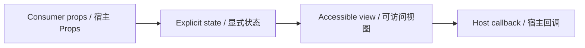

# ProjectCard · inspection / ProjectCard

> Reference ID: **A30** · 04 · 4.9

## 用途 / Purpose

`ProjectCard` is the reusable infission component mapped to `A30` in the reference board. It receives data through props and leaves routing, networking, permissions, payments, and business state to the consumer.

`ProjectCard` 是 `A30` 对应的可复用 infission 组件。组件通过 Props 接收数据并展示状态；路由、网络、权限、支付和业务状态由宿主项目负责。

## 安装与导入 / Install and import

```bash
pnpm add infisson_ui
```

```tsx
import { ProjectCard } from "infisson_ui";
import "infisson_ui/styles.css";
```

## Props / 属性

| Prop | Type | 中文说明 / English |
|---|---|---|
| `project` | `ProjectCardData` | 必填项目数据 / Required project data |
| `project.id` | `string` | 项目 ID / Project identifier |
| `project.title` | `string` | 项目标题 / Project title |
| `project.address?` | `string` | 地址，长文本可换行 / Address, long text may wrap |
| `project.jurisdiction?` | `string` | 地址后的辖区 / Jurisdiction appended to address |
| `project.imageSrc?` | `string` | 可选媒体地址，缺失时显示占位 / Optional media URL, placeholder when missing |
| `project.status` | `"under-review" | "delayed" | "missing-docs" | "interconnection" | "inspection"` | 语义状态变体 / Semantic status variant |
| `project.progress` | `number` | 许可进度百分比 / Permit progress percentage |
| `project.system?` | `string` | 系统容量或值 / System size or value |
| `project.battery?` | `string` | 电池值，缺失显示 `None` / Battery value, `None` when missing |
| `project.owner?` | `string` | 负责人 / Responsible owner |
| `project.due?` | `string` | 到期日期文案 / Due date text |
| `onOpen?` | `(project: ProjectCardData) => void` | 点击明确打开按钮时调用 / Called by explicit open button |
| `className?` | `string` | 自定义根类名 / Custom root class |

`dist/index.d.ts` 是发布包的权威声明；组件变体沿用同一 Props 契约。/ `dist/index.d.ts` is the authoritative declaration shipped with the package; visual variants use the same Props contract.

## 可复制调用 / Copyable usage

```tsx
import { ProjectCard } from "infisson_ui";
import "infisson_ui/styles.css";
export function ProjectCardExample() {
  return (
    <section data-infisson aria-label="ProjectCard example">
      <ProjectCard project={{ id: "PL-2767", title: "6 Crescent Path", address: "Nova Ridge, NR", jurisdiction: "Northwind County", status: "inspection", progress: 96, system: "64 units", owner: "Samira Cole", due: "Oct 9" }} onOpen={(project) => console.log("Open", project.id)} />
    </section>
  );
}
```

Inspection is a workflow stage, not a completion flag; connect `onOpen` to the host inspection route or panel. / Inspection 是流程阶段，不是完成标志，可将 `onOpen` 接到宿主检查路由或面板。

## 状态与边界 / States and edge cases

- Inspection remains a distinct green status even at 96% progress; green does not mean the whole permit is complete.
- `onOpen` fires only from the labelled arrow button; status and media text do not navigate.
- Missing image, battery, owner, or due data stays explicit and readable; progress may be zero.
- Long addresses can wrap and repeated clicks emit one callback per click.

- 即使 96% 进度，Inspection 仍是独立绿色状态；绿色不表示整个许可完成。
- 只有带标签的箭头按钮会触发 `onOpen`；状态或媒体文案不会导航。
- 缺少图片、电池、负责人或日期仍显式可读，进度可以为零。
- 长地址可换行，每次点击只发出一次回调。

## 无障碍 / Accessibility

- Keep native semantics and visible labels; color alone never communicates state.
- Interactive elements are keyboard reachable and show a visible `:focus-visible` indicator.
- Important updates use an appropriate status or live region; decorative icons are hidden from assistive technology.
- `prefers-reduced-motion: reduce` disables non-essential movement.

- 保留原生语义和可见标签，不能只依赖颜色表达状态。
- 交互元素可用键盘访问，并显示清晰的 `:focus-visible` 焦点指示。
- 重要更新使用合适的 status 或 live region，装饰图标对辅助技术隐藏。
- `prefers-reduced-motion: reduce` 会关闭非必要动效。

## 主题与配图 / Theme and visual reference

```css
[data-infisson] {
  --inf-color-brand: #c5f33e;
  --inf-color-surface-inverse: #111214;
}
```


图片是静态范围基线；视频中未逐帧确认的行为会标为 `implementation-proposal`。The image is the static scope baseline; motion not verified frame-by-frame remains `implementation-proposal`.



