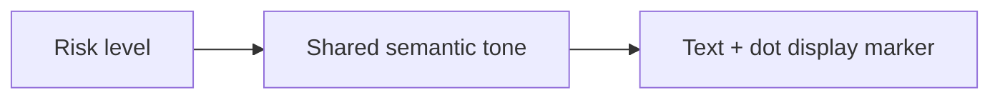

# RiskBadge / RiskBadge

> Reference ID: **A32** · 05 · 5.2 · image-confirmed; display-only

## 用途 / Purpose

`RiskBadge` is a display-only semantic marker for `high`, `medium`, or `low` risk. It does not open a panel or mutate risk state; a surrounding row or action control should own navigation.

`RiskBadge` 是展示型风险语义标记，支持 `high`、`medium`、`low`。它不会打开面板或修改风险状态；导航应由外层行或操作控件负责。

## 安装与导入 / Install and import

```bash
pnpm add infisson_ui
```

```tsx
import { RiskBadge } from "infisson_ui";
import "infisson_ui/styles.css";
```

## Props / 属性

| Prop | Type | Required | 中文说明 / English |
|---|---|---:|---|
| `level` | `"high" \| "medium" \| "low"` | Yes | 风险等级；semantic risk level |
| `label` | `string` | No | 覆盖默认文案；custom visible label |
| `className` | `string` | No | 附加 CSS 类名；additional class name |

## 可复制调用 / Copyable usage

```tsx
import { RiskBadge } from "infisson_ui";

export function RiskMarkers() {
  return <div aria-label="Risk levels"><RiskBadge level="high" label="High risk" /><RiskBadge level="medium" /><RiskBadge level="low" /></div>;
}
```

## 状态与边界 / States and edge cases

- The three levels map to shared danger, warning, and success tones and are rendered as text plus a dot.
- A custom `label` changes visible copy only; `level` remains the semantic styling input.
- Empty labels are technically allowed but should be avoided because the marker would lose its accessible text.
- RiskBadge has no click, hover action, loading, or disabled state by design; use an adjacent button for actions.

- 三种等级映射统一的 danger、warning、success 色调，并同时显示文字和圆点。
- `label` 只改可见文案，`level` 仍决定语义样式。
- 虽允许空字符串，但不建议使用，以免标记失去可访问文字。
- RiskBadge 按设计没有点击、加载或禁用状态，需要操作时请提供相邻按钮。

## 无障碍 / Accessibility

- The visible label is the accessible name; consumers must not communicate risk through color alone.
- This is a non-interactive `span`, so it does not add a tab stop or button role.
- If the badge is inside an interactive row, keep the row's accessible name descriptive and do not nest another interactive control.

- 可见文案就是辅助技术名称，不能只依赖颜色表达风险。
- 组件是非交互 `span`，不会增加 Tab 停靠点或 button 角色。
- 如果放在可交互行中，应保证行名称完整，避免再嵌套交互控件。

## 主题与配图 / Theme and visual reference

```css
[data-infisson] {
  --inf-color-danger: #ef4444;
  --inf-color-warning: #f59e0b;
  --inf-color-success: #84cc16;
}
```


The reference confirms a static risk marker; no click behavior is claimed. / 参考图确认静态风险标记，不宣称存在点击行为。


