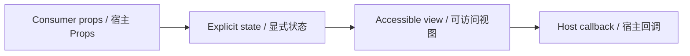

# SearchField / SearchField

> Reference ID: **A09** · 02 · 2.1

## 用途 / Purpose

`SearchField` is the reusable infission component mapped to `A09` in the reference board. It receives data through props and leaves routing, networking, permissions, payments, and business state to the consumer.

`SearchField` 是 `A09` 对应的可复用 infission 组件。组件通过 Props 接收数据并展示状态；路由、网络、权限、支付和业务状态由宿主项目负责。

## 安装与导入 / Install and import

```bash
pnpm add infisson_ui
```

```tsx
import { SearchField } from "infisson_ui";
import "infisson_ui/styles.css";
```

## Props / 属性

| Prop | Type | 中文说明 / English |
|---|---|---|
| `value?` | `string` | 受控输入值；不传时组件使用内部状态 / Controlled value; omit for internal state |
| `defaultValue?` | `string` | 非受控模式的初始值 / Initial value for uncontrolled mode |
| `placeholder?` | `string` | 输入提示和默认无障碍名称 / Input hint and default accessible name |
| `shortcut?` | `string` | 右侧键盘提示文本，仅用于视觉提示；省略时显示明确的提交箭头 / Optional keyboard hint shown on the right; omission renders a clear submit arrow |
| `onChange?` | `(value: string) => void` | 每次输入变化时回调 / Called for each input change |
| `onSubmit?` | `(value: string) => void` | 提交表单或按 Enter 时回调 / Called on form submit or Enter |
| `disabled?` | `boolean` | 禁用输入和提交 / Disables input and submission |
| `className?` | `string` | 自定义 class 名 / Optional custom class name |

`dist/index.d.ts` 是发布包的权威声明；组件变体沿用同一 Props 契约。/ `dist/index.d.ts` is the authoritative declaration shipped with the package; visual variants use the same Props contract.

## 可复制调用 / Copyable usage

```tsx
import { useState } from "react";

export function SearchFieldExample() {
  const [query, setQuery] = useState("");
  return (
    <section data-infisson aria-label="SearchField example">
      <SearchField
        value={query}
        onChange={setQuery}
        onSubmit={(value) => console.log("search", value)}
        placeholder="Search projects"
        shortcut="Enter"
        className="example-searchfield"
      />
    </section>
  );
}
```

Import `useState` from React in the example. Use `value` with `onChange` for a controlled field, or use `defaultValue` for an uncontrolled field. Enter submits the current value without navigating; the component does not run a search or call a service. / 示例需从 React 导入 `useState`。受控模式同时传入 `value` 与 `onChange`，非受控模式使用 `defaultValue`。按 Enter 会提交当前值但不会跳转；组件不执行搜索，也不调用外部服务。

## 状态与边界 / States and edge cases

- Default, focus-visible, typing, submit, and disabled states are supported. Empty queries are submitted as an empty string when the host presses Enter; long values remain in the native input and do not change the callback contract.
- Missing or unknown data stays visible as an empty or pending state; it must not be represented as a successful result.
- Long labels, zero values, missing media, duplicate clicks, and narrow viewports are handled without breaking the surrounding layout.
- State changes are interruptible, and callbacks are not fired twice for one user action.

- 支持默认、可见焦点、输入、提交和禁用状态。宿主按 Enter 时空查询会以空字符串提交；长文本保留在原生输入框中，不改变回调契约。
- 缺失或未知数据保持为空或待处理状态，不能伪装成成功。
- 长标签、零值、缺少图片、重复点击和窄视口不能破坏布局。
- 状态切换可中断，一次用户动作不会重复触发回调。

## 无障碍 / Accessibility

- Keep native semantics and visible labels; color alone never communicates state.
- Interactive elements are keyboard reachable and show a visible `:focus-visible` indicator.
- Important updates use an appropriate status or live region; decorative icons are hidden from assistive technology.
- `prefers-reduced-motion: reduce` disables non-essential movement.

- 保留原生语义和可见标签，不能只依赖颜色表达状态。
- 交互元素可用键盘访问，并显示清晰的 `:focus-visible` 焦点指示。
- 重要更新使用合适的 status 或 live region，装饰图标对辅助技术隐藏。
- `prefers-reduced-motion: reduce` 会关闭非必要动效。

## 主题与配图 / Theme and visual reference

```css
[data-infisson] {
  --inf-color-brand: #c5f33e;
  --inf-color-surface-inverse: #111214;
}
```


图片是静态范围基线；视频中未逐帧确认的行为会标为 `implementation-proposal`。The image is the static scope baseline; motion not verified frame-by-frame remains `implementation-proposal`.


