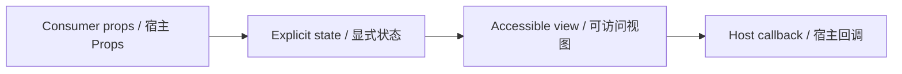

# SidebarAIWidget / SidebarAIWidget

> Reference ID: **A07** · 01 · 1.7

## 用途 / Purpose

`SidebarAIWidget` is the reusable infission component mapped to `A07` in the reference board. It receives data through props and leaves routing, networking, permissions, payments, and business state to the consumer.

`SidebarAIWidget` 是 `A07` 对应的可复用 infission 组件。组件通过 Props 接收数据并展示状态；路由、网络、权限、支付和业务状态由宿主项目负责。

## 安装与导入 / Install and import

```bash
pnpm add infisson_ui
```

```tsx
import { SidebarAIWidget } from "infisson_ui";
import "infisson_ui/styles.css";
```

## Props / 属性

| Prop | Type | 中文说明 / English |
|---|---|---|
| `title?` | `string` | 标题 / widget title |
| `message?` | `string` | 风险说明 / supporting message |
| `count?` | `number` | 待处理数量 / attention count |
| `actionLabel?` | `string` | 操作按钮文本 / action label |
| `onAction?` | `() => void` | 点击操作回调 / action callback |
| `enabled?` | `boolean` | 受控开关值 / controlled switch value |
| `defaultEnabled?` | `boolean` | 非受控初始值 / uncontrolled initial value |
| `onEnabledChange?` | `(enabled: boolean) => void` | 开关变化回调 / switch callback |
| `disabled?` | `boolean` | 禁用开关和操作 / disable interactions |
| `switchLabel?` | `string` | 开关无障碍名称 / accessible switch label |
| `className?` | `string` | 自定义类名 / custom class name |

`dist/index.d.ts` 是发布包的权威声明；组件变体沿用同一 Props 契约。/ `dist/index.d.ts` is the authoritative declaration shipped with the package; visual variants use the same Props contract.

## 可复制调用 / Copyable usage

```tsx
import { useState } from "react";
import { SidebarAIWidget } from "infisson_ui";

export function SidebarAIWidgetExample() {
  const [enabled, setEnabled] = useState(true);
  return (
    <section data-infisson aria-label="SidebarAIWidget example">
      <SidebarAIWidget count={7} enabled={enabled} onEnabledChange={setEnabled} onAction={() => console.log("review risks")} />
    </section>
  );
}
```

Use `enabled` with `onEnabledChange` for controlled forms, or use `defaultEnabled` when the host does not need to own the toggle. The action is disabled while AI is paused or when `onAction` is not supplied. / 使用 `enabled` 和 `onEnabledChange` 管理受控表单；不需要宿主维护时使用 `defaultEnabled`。AI 暂停或未提供 `onAction` 时，操作按钮会禁用。

For components with required data, pass the required fields listed above; callbacks remain owned by the host application. / 如果组件需要必填数据，请按上表传入；回调由宿主应用负责。

## 状态与边界 / States and edge cases

- Default, hover, focus-visible, active/selected, disabled, loading, error, and empty states are explicit where supported by the component Props.
- Missing or unknown data stays visible as an empty or pending state; it must not be represented as a successful result.
- Long labels, zero values, missing media, duplicate clicks, and narrow viewports are handled without breaking the surrounding layout.
- State changes are interruptible, and callbacks are not fired twice for one user action.

- 默认、悬停、可见焦点、激活/选中、禁用、加载、错误和空状态按组件 Props 显式表达。
- 缺失或未知数据保持为空或待处理状态，不能伪装成成功。
- 长标签、零值、缺少图片、重复点击和窄视口不能破坏布局。
- 状态切换可中断，一次用户动作不会重复触发回调。
- The switch is keyboard-operable, exposes `role="switch"` and `aria-checked`, and the action button follows the current enabled state. / 开关可用键盘操作，暴露 `role="switch"` 与 `aria-checked`，操作按钮跟随当前启用状态。

## 无障碍 / Accessibility

- Keep native semantics and visible labels; color alone never communicates state.
- Interactive elements are keyboard reachable and show a visible `:focus-visible` indicator.
- Important updates use an appropriate status or live region; decorative icons are hidden from assistive technology.
- `prefers-reduced-motion: reduce` disables non-essential movement.

- 保留原生语义和可见标签，不能只依赖颜色表达状态。
- 交互元素可用键盘访问，并显示清晰的 `:focus-visible` 焦点指示。
- 重要更新使用合适的 status 或 live region，装饰图标对辅助技术隐藏。
- `prefers-reduced-motion: reduce` 会关闭非必要动效。

## 主题与配图 / Theme and visual reference

```css
[data-infisson] {
  --inf-color-brand: #c5f33e;
  --inf-color-surface-inverse: #111214;
  --inf-color-on-surface-inverse: #fff;
  --inf-color-on-inverse-accent: #c5f33e;
  --inf-global-ai-widget-bg: var(--inf-color-surface-inverse);
  --inf-global-ai-widget-fg: var(--inf-color-on-surface-inverse);
  --inf-global-ai-widget-muted: color-mix(in srgb, var(--inf-global-ai-widget-fg) 72%, transparent);
  --inf-global-ai-widget-accent: var(--inf-color-on-inverse-accent);
  --inf-global-ai-widget-switch-track-off: #3c4654;
  --inf-global-ai-widget-switch-track-on: var(--inf-color-on-inverse-accent);
  --inf-global-ai-widget-switch-thumb: var(--inf-color-on-surface-inverse);
}
```

The widget keeps its dark background, readable foreground, muted copy and accent as separate semantic variables. Its switch also exposes distinct off-track, on-track and thumb variables so all three layers remain visible across themes. Override the four `--inf-global-ai-widget-*` surface values or the three `--inf-global-ai-widget-switch-*` variables in a scoped host when a single widget needs custom colors; keep background/foreground pairs together. / 组件将深色背景、可读前景、辅助文字和强调色拆成语义变量。开关额外暴露关闭轨道、开启轨道和滑块三个变量，保证各主题下三层都可区分。单个组件需要定制颜色时，在作用域内覆盖四个 `--inf-global-ai-widget-*` 表面变量或三个 `--inf-global-ai-widget-switch-*` 开关变量，并始终成对覆盖背景和前景。


图片是静态范围基线；视频中未逐帧确认的行为会标为 `implementation-proposal`。The image is the static scope baseline; motion not verified frame-by-frame remains `implementation-proposal`.


