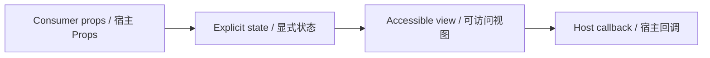

# StatusBadge / StatusBadge

> Reference ID: **A13** · 02 · 2.5

## 用途 / Purpose

`StatusBadge` is the reusable infission component mapped to `A13` in the reference board. It receives data through props and leaves routing, networking, permissions, payments, and business state to the consumer.

`StatusBadge` 是 `A13` 对应的可复用 infission 组件。组件通过 Props 接收数据并展示状态；路由、网络、权限、支付和业务状态由宿主项目负责。

## 安装与导入 / Install and import

```bash
pnpm add infisson_ui
```

```tsx
import { StatusBadge } from "infisson_ui";
import "infisson_ui/styles.css";
```

## Props / 属性

| Prop | Type | 中文说明 / English |
|---|---|---|
| `status` | `"on-track" \| "under-review" \| "delayed" \| "missing-docs" \| "interconnection" \| "inspection" \| "approved" \| "complete"` | 必填状态值，决定默认标签和颜色 / Required status; selects the default label and tone |
| `label?` | `string` | 自定义显示文本 / Custom visible label |
| `size?` | `"sm" \| "md"` | 尺寸，默认 `sm` / Size, defaults to `sm` |
| `className?` | `string` | 自定义 class 名 / Optional custom class name |

`dist/index.d.ts` 是发布包的权威声明；组件变体沿用同一 Props 契约。/ `dist/index.d.ts` is the authoritative declaration shipped with the package; visual variants use the same Props contract.

## 可复制调用 / Copyable usage

```tsx
export function StatusBadgeExample() {
  return (
    <section data-infisson aria-label="StatusBadge example">
      <StatusBadge status="under-review" label="Needs review" size="md" className="example-statusbadge" />
    </section>
  );
}
```

`StatusBadge` is intentionally display-only. To make a status clickable, wrap it in a separately labelled control and keep the badge itself semantic text. / `StatusBadge` 有意设计为只展示状态。若要让状态可点击，请使用带名称的独立控件包裹它，并保持 badge 本身为语义文本。

## 状态与边界 / States and edge cases

- The supported states are the eight `status` values, custom labels, and `sm`/`md` sizes. There is no hover, focus, loading, or disabled interaction because the output is not a control.
- Missing or unknown data stays visible as an empty or pending state; it must not be represented as a successful result.
- Long labels, zero values, missing media, duplicate clicks, and narrow viewports are handled without breaking the surrounding layout.
- State changes are interruptible, and callbacks are not fired twice for one user action.

- 支持八种 `status` 值、自定义文本和 `sm`/`md` 尺寸。由于输出不是控件，没有悬停、焦点、加载或禁用交互。
- 缺失或未知数据保持为空或待处理状态，不能伪装成成功。
- 长标签、零值、缺少图片、重复点击和窄视口不能破坏布局。
- 状态切换可中断，一次用户动作不会重复触发回调。

## 无障碍 / Accessibility

- Keep native semantics and visible labels; color alone never communicates state.
- Interactive elements are keyboard reachable and show a visible `:focus-visible` indicator.
- Important updates use an appropriate status or live region; decorative icons are hidden from assistive technology.
- `prefers-reduced-motion: reduce` disables non-essential movement.

- 保留原生语义和可见标签，不能只依赖颜色表达状态。
- 交互元素可用键盘访问，并显示清晰的 `:focus-visible` 焦点指示。
- 重要更新使用合适的 status 或 live region，装饰图标对辅助技术隐藏。
- `prefers-reduced-motion: reduce` 会关闭非必要动效。

## 主题与配图 / Theme and visual reference

```css
[data-infisson] {
  --inf-color-brand: #c5f33e;
  --inf-color-surface-inverse: #111214;
}
```


图片是静态范围基线；视频中未逐帧确认的行为会标为 `implementation-proposal`。The image is the static scope baseline; motion not verified frame-by-frame remains `implementation-proposal`.


