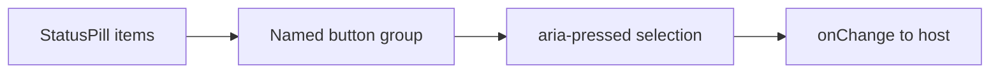

# StatusPillSet / StatusPillSet

> Reference ID: **A31** · 05 · 5.1 · image-confirmed; interaction is an implementation proposal

## 用途 / Purpose

`StatusPillSet` renders a mutually exclusive set of status pills. It is interactive when the host supplies `onChange`; it supports controlled and uncontrolled selection. The pill is a filter/control, while status colors are only visual cues.

`StatusPillSet` 渲染互斥的状态标签集合。宿主传入 `onChange` 后可交互，同时支持受控和非受控选中状态。标签是筛选/控制器，颜色只作为辅助视觉提示。

## 安装与导入 / Install and import

```bash
pnpm add infisson_ui
```

```tsx
import { StatusPillSet, type StatusPill } from "infisson_ui";
import "infisson_ui/styles.css";
```

## Props / 属性

| Prop | Type | Required | 中文说明 / English |
|---|---|---:|---|
| `items` | `StatusPill[]` (`{ value: string; label: string; tone?: BadgeTone }`) | Yes | 状态选项；each option needs a stable value and visible label |
| `value` | `string` | No | 受控选中值；controlled selected value |
| `defaultValue` | `string` | No | 非受控初始值；uncontrolled initial value |
| `onChange` | `(value: string) => void` | No | 选择变化回调；called once after a user selection |
| `ariaLabel` | `string` | No | 分组可访问名称，默认 `Status`；accessible group name |
| `className` | `string` | No | 附加 CSS 类名；additional class name |

## 可复制调用 / Copyable usage

```tsx
import { useState } from "react";
import { StatusPillSet } from "infisson_ui";

export function StatusFilters() {
  const [status, setStatus] = useState("all");
  return <StatusPillSet ariaLabel="Project status" items={[{ value: "all", label: "All" }, { value: "review", label: "Under review", tone: "warning" }, { value: "risk", label: "At risk", tone: "danger" }]} value={status} onChange={setStatus} />;
}
```

## 状态与边界 / States and edge cases

- Native buttons expose `aria-pressed`; `defaultValue` makes the component usable without a state store.
- `value` takes precedence over `defaultValue`; controlled consumers must update `value` after `onChange`.
- An empty `items` array renders an empty labelled group. Avoid duplicate `value` keys.
- Long labels follow the surrounding layout; no network or business state is inferred.

- 使用原生按钮和 `aria-pressed`；`defaultValue` 可在没有状态管理器时直接使用。
- 受控模式下 `value` 优先，宿主应在 `onChange` 后更新 `value`。
- `items` 为空时显示空的已命名分组；应避免重复 `value`。
- 长标签遵循外层布局；组件不会推断网络或业务状态。

## 无障碍 / Accessibility

- The group has an accessible name and each option exposes its visible label.
- Keyboard users can operate native buttons and perceive selection through `aria-pressed`, not color alone.
- Keep labels meaningful; focus styles come from the shared theme.

- 分组和每个选项都有可访问名称，键盘可直接操作原生按钮。
- 选中状态通过 `aria-pressed` 表达，不能只依赖颜色。
- `label` 应具有实际含义；焦点样式由统一主题提供。

## 主题与配图 / Theme and visual reference

```css
[data-infisson] {
  --inf-color-brand: #c5f33e;
  --inf-color-surface-inverse: #111214;
  --inf-color-focus: #7c3aed;
}
```


The image confirms the static pill set; selection behavior is a reusable implementation proposal and is not claimed as frame-by-frame video evidence. / 参考图确认静态标签集合；选中行为是可复用实现建议，不宣称已逐帧视频确认。


