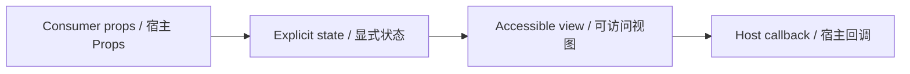

# UserProfileCard / UserProfileCard

> Reference ID: **A08** · 01 · 用户信息卡

## 用途 / Purpose

`UserProfileCard` is the reusable infission component mapped to `A08` in the reference board. It receives data through props and leaves routing, networking, permissions, payments, and business state to the consumer.

`UserProfileCard` 是 `A08` 对应的可复用 infission 组件。组件通过 Props 接收数据并展示状态；路由、网络、权限、支付和业务状态由宿主项目负责。

## 安装与导入 / Install and import

```bash
pnpm add infisson_ui
```

```tsx
import { UserProfileCard } from "infisson_ui";
import "infisson_ui/styles.css";
```

## Props / 属性

| Prop | Type | 中文说明 / English |
|---|---|---|
| `name` | `string` | 必填，用户显示名称 / Required display name |
| `role` | `string` | 可选，角色或职务副标题 / Optional role or job subtitle |
| `avatarUrl` | `string` | 可选，头像图片地址；传入后使用图片 / Optional avatar URL; uses the image when provided |
| `initials` | `string` | 可选，无头像图片时的备用缩写；默认取名称前两个字符 / Optional fallback initials; defaults to the first two name characters |
| `onClick` | `() => void` | 可选，点击卡片时触发；宿主可打开个人操作区 / Optional click callback; host can open profile actions |
| `moreActions` | `UserProfileAction[]` | 可选，三个点菜单项；每项包含 `id`、`label`、可选 `onSelect` 和 `disabled` / Optional actions for the three-dot menu; each item has `id`, `label`, optional `onSelect`, and `disabled` |
| `onMoreClick` | `() => void` | 可选，点击三个点时触发；菜单仍由 `moreActions` 控制 / Optional callback when the more button is clicked; menu visibility still comes from `moreActions` |
| `moreLabel` | `string` | 可选，更多操作按钮和菜单的无障碍名称 / Optional accessible name for the more button and menu |
| `className` | `string` | 可选，自定义 class 名 / Optional custom class name |

`dist/index.d.ts` 是发布包的权威声明；组件变体沿用同一 Props 契约。/ `dist/index.d.ts` is the authoritative declaration shipped with the package; visual variants use the same Props contract.

## 可复制调用 / Copyable usage

```tsx
export function UserProfileCardExample() {
  return (
    <section data-infisson aria-label="UserProfileCard example">
      <UserProfileCard
        name="Avery Chen"
        role="Operations Manager"
        onClick={() => console.log("open profile actions")}
        avatarUrl="/references/infission/avatar-avery-chen.svg"
        moreActions={[
          { id: "profile", label: "View profile", onSelect: () => console.log("view profile") },
          { id: "settings", label: "Account settings", onSelect: () => console.log("settings") },
        ]}
        className="example-userprofilecard"
      />
    </section>
  );
}
```

The profile area is a native button, so pointer and keyboard activation call `onClick` once. The separate three-dot button exposes a labelled menu; selecting an item invokes its `onSelect` and closes the menu, while Escape or an outside click also closes it. The component does not own routing or account data; the host decides what callbacks open. When `avatarUrl` is absent, `initials` (or the first two characters of `name`) is rendered as the fallback avatar. / 用户信息区域使用原生 button，鼠标和键盘激活都会触发一次 `onClick`。三个点是独立且有名称的菜单按钮；选择菜单项会调用 `onSelect` 并关闭菜单，Escape 或点击外部也会关闭菜单。组件不拥有路由或账户数据，回调打开什么内容由宿主决定。未提供 `avatarUrl` 时显示 `initials`，未提供 `initials` 时取 `name` 前两个字符作为备用头像。

## 状态与边界 / States and edge cases

- Default, hover, focus-visible, pressed, open, and menu-item disabled states are explicit. An omitted avatar uses the initials fallback; an empty `moreActions` array leaves the more button available for `onMoreClick` without rendering a menu.
- Missing or unknown data stays visible as an empty or pending state; it must not be represented as a successful result.
- Long labels, zero values, missing media, duplicate clicks, and narrow viewports are handled without breaking the surrounding layout.
- State changes are interruptible, and callbacks are not fired twice for one user action.

- 默认、悬停、可见焦点、按下、菜单打开和菜单项禁用状态都有明确表达。缺少头像时使用缩写备用内容；`moreActions` 为空时三个点仍可触发 `onMoreClick`，但不渲染菜单。组件没有加载和错误 Props，这些状态由宿主应用管理。
- 缺失或未知数据保持为空或待处理状态，不能伪装成成功。
- 长标签、零值、缺少图片、重复点击和窄视口不能破坏布局。
- 状态切换可中断，一次用户动作不会重复触发回调。

## 无障碍 / Accessibility

- Keep native semantics and visible labels; color alone never communicates state.
- Interactive elements are keyboard reachable and show a visible `:focus-visible` indicator.
- Important updates use an appropriate status or live region; decorative icons are hidden from assistive technology.
- `prefers-reduced-motion: reduce` disables non-essential movement.

- 保留原生语义和可见标签，不能只依赖颜色表达状态。
- 交互元素可用键盘访问，并显示清晰的 `:focus-visible` 焦点指示。
- 重要更新使用合适的 status 或 live region，装饰图标对辅助技术隐藏。
- `prefers-reduced-motion: reduce` 会关闭非必要动效。

## 主题与配图 / Theme and visual reference

```css
[data-infisson] {
  --inf-color-brand: #c5f33e;
  --inf-color-surface-inverse: #111214;
}
```


图片是静态范围基线；视频中未逐帧确认的行为会标为 `implementation-proposal`。The image is the static scope baseline; motion not verified frame-by-frame remains `implementation-proposal`.



