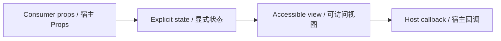

# ViewToggle / ViewToggle

> Reference ID: **A25** · 04 · 4.4

## 用途 / Purpose

`ViewToggle` is the reusable infission component mapped to `A25` in the reference board. It receives data through props and leaves routing, networking, permissions, payments, and business state to the consumer.

`ViewToggle` 是 `A25` 对应的可复用 infission 组件。组件通过 Props 接收数据并展示状态；路由、网络、权限、支付和业务状态由宿主项目负责。

## 安装与导入 / Install and import

```bash
pnpm add infisson_ui
```

```tsx
import { ViewToggle } from "infisson_ui";
import "infisson_ui/styles.css";
```

## Props / 属性

| Prop | Type | 中文说明 / English |
|---|---|---|
| `value?` | `"grid" | "list"` | 组件 API 字段 / component API field |
| `defaultValue?` | `"grid" | "list"` | 非受控初始布局，默认 `grid` / Initial uncontrolled layout, default `grid` |
| `onChange?` | `(value: "grid" | "list") => void` | 切换后调用 / Called after switching |
| `disabled?` | `boolean` | 禁用两个按钮 / Disable both buttons |
| `className?` | `string` | 自定义根类名 / Custom root class |

`dist/index.d.ts` 是发布包的权威声明；组件变体沿用同一 Props 契约。/ `dist/index.d.ts` is the authoritative declaration shipped with the package; visual variants use the same Props contract.

## 可复制调用 / Copyable usage

```tsx
import { useState } from "react";
import { ViewToggle } from "infisson_ui";
import "infisson_ui/styles.css";
export function ViewToggleExample() {
  const [value, setValue] = useState<"grid" | "list">("grid");
  return <ViewToggle value={value} onChange={setValue} />;
}
```

The callback changes the host layout while preserving filters, sorting, and selected data. / 回调只改变宿主布局，同时保留筛选、排序和选中数据。

## 状态与边界 / States and edge cases

- Exactly one button exposes `aria-pressed="true"`; `disabled` ignores clicks and preserves the current mode.
- Controlled `value` is authoritative; `defaultValue` is for local uncontrolled use.
- Layout animation belongs to the result list, so switching does not duplicate project items.
- Each enabled click calls `onChange` once.

- 只有一个按钮暴露 `aria-pressed="true"`；`disabled` 忽略点击并保持当前布局。
- 受控 `value` 为准；`defaultValue` 用于本地非受控状态。
- 布局动画属于结果列表，切换不会复制项目项。
- 每次启用点击只调用一次 `onChange`。

## 无障碍 / Accessibility

- Keep native semantics and visible labels; color alone never communicates state.
- Interactive elements are keyboard reachable and show a visible `:focus-visible` indicator.
- Important updates use an appropriate status or live region; decorative icons are hidden from assistive technology.
- `prefers-reduced-motion: reduce` disables non-essential movement.

- 保留原生语义和可见标签，不能只依赖颜色表达状态。
- 交互元素可用键盘访问，并显示清晰的 `:focus-visible` 焦点指示。
- 重要更新使用合适的 status 或 live region，装饰图标对辅助技术隐藏。
- `prefers-reduced-motion: reduce` 会关闭非必要动效。

## 主题与配图 / Theme and visual reference

```css
[data-infisson] {
  --inf-color-brand: #c5f33e;
  --inf-color-surface-inverse: #111214;
}
```


图片是静态范围基线；视频中未逐帧确认的行为会标为 `implementation-proposal`。The image is the static scope baseline; motion not verified frame-by-frame remains `implementation-proposal`.


