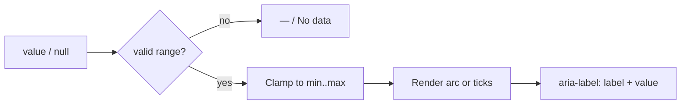

# ScoreGauge 评分仪表

## 用途 / Purpose

`ScoreGauge` 用圆环或刻度视觉表达一个有上下限的数值，例如合规分数、完成百分比或风险评分。需要用户调整时可启用受控拖拽/键盘交互；组件不发起数据请求，也不解释业务阈值。

`ScoreGauge` presents a bounded number as an arc or tick visual, such as compliance, completion, or risk scores. Optional controlled pointer and keyboard interaction can adjust the value; it does not fetch data or define business thresholds.

## 安装与导入 / Install and import

```bash
pnpm add infisson_ui
```

```tsx
import { ScoreGauge } from "infisson_ui";
import "infisson_ui/styles.css";
```

## Props

| Prop | Type | Default | 中文说明 / English |
| --- | --- | --- | --- |
| `value` | `number \| null` | required | 当前值；`null` 表示无数据 / current value; `null` means no data |
| `min` | `number` | `0` | 最小值 / minimum |
| `max` | `number` | `100` | 最大值 / maximum |
| `label` | `string` | required | 读屏和视觉标签 / accessible and visible label |
| `variant` | `"arc" \| "ticks"` | `"arc"` | 视觉变体 / visual variant |
| `formatValue` | `(value: number) => string` | percent text | 自定义显示格式 / display formatter |
| `interactive` | `boolean` | `false` | 启用拖拽、方向键、Home/End；/ Enables pointer drag, arrow keys, Home/End |
| `onChange?` | `(value: number) => void` | — | 交互值回调；使用时由宿主回写 `value` / change callback; the host writes the value back |
| `step` | `number` | `1` | 交互步长 / interaction step |
| `className` | `string` | — | 追加类名 / additional class names |

## 基本调用 / Basic usage

```tsx
export function ComplianceSummary({ score }: { score: number | null }) {
  return (
    <ScoreGauge
      value={score}
      label="Compliance / 合规度"
      variant="arc"
      formatValue={(value) => `${value.toFixed(0)}%`}
    />
  );
}
```

```tsx
function EditableScore() {
  const [score, setScore] = useState(87);
  return <ScoreGauge value={score} label="Compliance" interactive onChange={setScore} />;
}
```

分数暂不可用时传 `null`，组件会显示 `—` 和 `No data`，不要用 `0` 伪造结果。

Pass `null` while the score is unavailable. The component shows `—` and `No data`; do not use `0` to fabricate a result.

## 状态、边界与无障碍 / States, bounds, and accessibility

- `value` 会被限制在 `[min, max]` 范围内；`max <= min` 时进入无效范围并显示无数据。
- 默认外层使用 `role="img"`；启用 `interactive` 后使用 `role="slider"`、`aria-valuenow` 等滑块语义，SVG 仍为装饰性隐藏。
- 数值含义应在 `label` 中写清楚；如果业务需要高 / 中 / 低阈值，请在父组件提供文字说明。
- 组件不通过颜色单独传递风险，文本和数字始终可见。

- `value` is clamped to `[min, max]`; `max <= min` is treated as an invalid range and renders no data.
- The default wrapper uses `role="img"`; `interactive` switches to slider semantics with `aria-valuenow` and related attributes. The SVG remains decorative.
- Explain the metric in `label`; if the product has high/medium/low thresholds, the parent should provide the text explanation.
- Risk is never conveyed by color alone; the label and number remain visible.

## 主题与配图 / Theme and visual reference


图中的合规分数圆环是 `ScoreGauge` 的视觉基线；实现允许在 `arc` 和 `ticks` 间切换，但不把参考图里的示例数据当成实时值。

The compliance score ring is the visual baseline for `ScoreGauge`. The implementation supports `arc` and `ticks`, but the reference value is not treated as live data.


