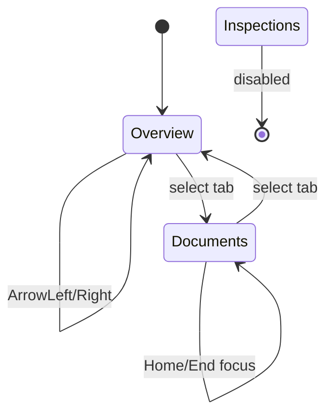

# Tabs 页签

## 用途 / Purpose

`Tabs` 提供可控或非可控的页签选择，并实现 `role="tablist"`、`role="tab"` 与键盘移动。`TabPanel` 负责对应内容区，两者通过稳定的 `id` 前缀建立可访问关系。

`Tabs` supports controlled and uncontrolled selection and implements the `tablist`, `tab`, and keyboard interaction semantics. `TabPanel` owns the content region; both are connected with a stable `id` prefix.

## 安装与导入 / Install and import

```bash
pnpm add infisson_ui
```

```tsx
import { Tabs, TabPanel, type TabItem } from "infisson_ui";
import "infisson_ui/styles.css";
```

## Props

### `Tabs`

| Prop | Type | Default | 中文说明 / English |
| --- | --- | --- | --- |
| `items` | `TabItem[]` | required | 页签配置 / tab configuration |
| `id` | `string` | generated | 与面板共享的稳定 ID 前缀 / stable prefix shared with panels |
| `value` | `string` | uncontrolled | 当前选中项 / controlled value |
| `defaultValue` | `string` | first enabled item | 初始选中项 / initial value |
| `onValueChange` | `(value: string) => void` | — | 选择变化回调 / selection callback |
| `aria-label` | `string` | `Tabs` | 页签列表标签 / tablist label |
| `className` | `string` | — | 追加类名 / additional class names |

`TabItem`：`{ id: string; label: string; count?: number; disabled?: boolean }`。

### `TabPanel`

| Prop | Type | Default | 中文说明 / English |
| --- | --- | --- | --- |
| `tabId` | `string` | required | 面板 ID，例如 `${tabsId}-${itemId}-panel` / panel ID |
| `labelledBy` | `string` | required | 对应 tab ID / associated tab ID |
| `active` | `boolean` | required | 是否显示 / whether visible |
| `children` | `ReactNode` | required | 面板内容 / panel content |

## 基本调用 / Basic usage

```tsx
const items: TabItem[] = [
  { id: "overview", label: "Overview" },
  { id: "documents", label: "Documents", count: 10 },
  { id: "inspections", label: "Inspections", disabled: true },
];

export function ProjectTabs() {
  const [value, setValue] = useState("overview");
  const tabsId = "project-tabs";

  return (
    <section data-infisson>
      <Tabs id={tabsId} items={items} value={value} onValueChange={setValue} aria-label="Project sections" />
      <TabPanel tabId={`${tabsId}-overview-panel`} labelledBy={`${tabsId}-overview`} active={value === "overview"}>
        Project overview
      </TabPanel>
      <TabPanel tabId={`${tabsId}-documents-panel`} labelledBy={`${tabsId}-documents`} active={value === "documents"}>
        Documents center
      </TabPanel>
    </section>
  );
}
```

## 状态、键盘与无障碍 / States, keyboard, and accessibility

- 受控模式由 `value` 驱动；非受控模式使用 `defaultValue`，不要同时依赖两套状态。
- `ArrowLeft` / `ArrowRight` 在可用页签间移动焦点；`Home` / `End` 跳到首尾；点击或回车后由 `onValueChange` 更新内容。
- 禁用项不能被聚焦或选中；面板通过 `hidden` 保持 DOM 结构稳定。
- 传入 `id` 可以让服务端渲染、快照和 `TabPanel` 关联保持稳定。

- Controlled mode is driven by `value`; uncontrolled mode uses `defaultValue`. Do not maintain two competing sources of truth.
- `ArrowLeft` / `ArrowRight` move focus across enabled tabs; `Home` / `End` jump to the first or last; selection is committed through `onValueChange`.
- Disabled items cannot receive focus or selection; panels use `hidden` to keep structure stable.
- Pass `id` for stable SSR, snapshot, and `TabPanel` relationships.

## 主题与配图 / Theme and visual reference


图中“Category Tabs”和“Status Filter”是页签、计数和筛选控件组合的参考。

The “Category Tabs” and “Status Filter” areas show the intended relationship between tabs, counts, and filtering controls.


