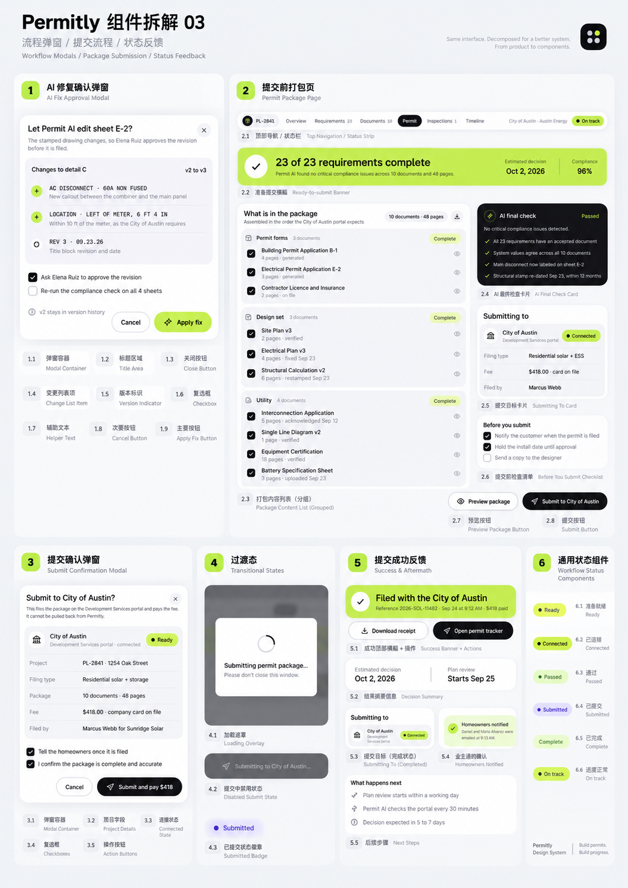
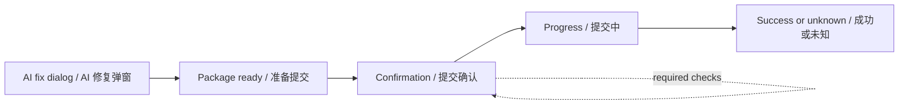

# infisson workflow components / 工作流组件

> 这份帮助文件覆盖图 03 的流程组件（C01–C36）。每个导出的组件都在下方有独立锚点，内容包括 Props、调用示例、状态、无障碍和参考证据。This bilingual guide covers the workflow components mapped to reference image 03. Every exported component has its own anchor with Props, usage, states, accessibility, and evidence.

## Evidence / 证据

静态基线来自 [图 03](../../references/infission/03_workflows_submission_feedback.png)。视频审计帧位于 [`references/frames/workflow-audit/`](../../references/frames/workflow-audit/README.md)，它们是从用户提供的 MP4 导出的开发证据，不是新增原始设计图。The static baseline is reference image 03. Audit frames are derived from the supplied MP4 and are development evidence rather than new source designs.





本库只提供可复用的前端状态和回调，不连接真实门户、不支付、不发送通知。The library exposes UI state and callbacks only; it does not call a real portal, charge a card, or send notifications.

## Installation / 安装

```bash
pnpm add infisson_ui react react-dom
```

```tsx
import "infisson_ui/styles.css";
import "infisson_ui/workflow.css";
import { AIFixDialog, WorkflowBadge } from "infisson_ui";
```

If your bundler does not expose a workflow stylesheet entry yet, import `packages/infisson_ui/src/workflow/styles.css` alongside `styles.css` during local development. / 如果打包器尚未暴露 workflow 样式入口，开发时可同时导入源码中的 `workflow/styles.css`；发布前应由包入口提供同名 CSS 导出。

## C01–C09 · AI fix approval / AI 修复审批

### [`AIFixDialog`](#aifixdialog) · C01

复用 `Dialog` 展示 AI 建议、版本差异、审批选项和取消 / 应用操作。Use `Dialog` to review AI changes, version differences, approval options, and cancel/apply actions.

**Props / 属性**

| Prop | Type | Default | 说明 / Description |
|---|---|---|---|
| `open` | `boolean` | — | 是否打开 / whether visible |
| `onOpenChange` | `(open: boolean) => void` | — | 打开状态回调 / visibility callback |
| `changes` | `AIFixChange[]` | — | 变更行 / proposed changes |
| `fromVersion` / `toVersion` | `string` | `v2` / `v3` | 版本标记 / version labels |
| `requestApproval` | `boolean` | `true` | 请求审批 / request approval |
| `rerunCompliance` | `boolean` | `false` | 应用后重跑检查 / rerun compliance |
| `approverName` | `string` | `Mira Solis` | 审批人名称 / approver name |
| `onApplyFix` | `() => void \| Promise<void>` | — | 应用回调 / apply callback |
| `title`, `description`, `applyLabel`, `cancelLabel` | `string` | infisson defaults | 文案 / copy |

```tsx
<AIFixDialog
  open={isOpen}
  onOpenChange={setIsOpen}
  changes={[
    { id: "disconnect", kind: "added", label: "AC DISCONNECT · 60A NON FUSED", description: "New callout between the combiner and main panel" },
    { id: "location", kind: "updated", label: "LOCATION · LEFT OF METER, 6 FT 4 IN" },
  ]}
  onApplyFix={async () => setIsOpen(false)}
/>
```

`onApplyFix` 失败时弹窗保留打开状态并显示 `role="alert"`。Applying can be asynchronous; errors keep the dialog open and are announced through `role="alert"`.

### [`VersionIndicator`](#versionindicator) · C05

Props: `from?: string` and `to?: string` are required strings in the type. It renders `v2 → v3` and an accessible label. / Props：`from`、`to` 为必填字符串，显示版本迁移并提供可读标签。

| Prop | Type | Default | 说明 / Description |
|---|---|---|---|
| `from` | `string` | — | 原版本 / previous version |
| `to` | `string` | — | 新版本 / next version |

```tsx
<VersionIndicator from="v2" to="v3" />
```

### [`ChangeList`](#changelist) · C04

Props: `changes: AIFixChange[]`; each item has `id`, `label`, optional `description`, and `kind` (`added | updated | removed`). The list has an accessible label and a visual mark. / Props：变更数组；列表带无障碍标签，`kind` 决定增加、更新或删除的视觉标记。

| Prop | Type | Default | 说明 / Description |
|---|---|---|---|
| `changes` | `{ id: string; label: string; description?: string; kind?: "added" \| "updated" \| "removed" }[]` | — | 稳定 ID、标题、说明和变化类型 / stable change rows |

```tsx
<ChangeList changes={[{ id: "date", label: "REV 3 · 09.23.26", kind: "updated", description: "Title block revision and date" }]} />
```

### [`ApprovalOptions`](#approvaloptions) · C06

Props: optional `approverName` (default `Mira Solis`), `requestApproval`, `rerunCompliance`, and their `on...Change` callbacks. The component is controlled and uses native checkboxes. / Props：可选审批人名称（默认 `Mira Solis`）、两个布尔值和对应回调；组件受控，使用原生复选框。

```tsx
<ApprovalOptions requestApproval={true} rerunCompliance={false} onRerunComplianceChange={setRerun} />
```

The two checkboxes are independent controlled values. If a callback is omitted the value remains the supplied controlled value, so hosts should pass both callbacks when users must edit the options. / 两个复选框彼此独立且为受控值；需要用户编辑时请同时传入对应回调。

### [`VersionHistoryHint`](#versionhistoryhint) · C07

Props: optional `children`. Use it to explain that the previous revision remains available. / Props：可选 `children`，用于说明旧版本仍在历史记录中。

```tsx
<VersionHistoryHint>The previous revision stays available in version history.</VersionHistoryHint>
```

| Prop | Type | Default | 说明 / Description |
|---|---|---|---|
| `children` | `ReactNode` | previous revision copy | 辅助提示内容 / helper copy |

### [`Dialog` close action / DialogCloseButton](#dialog-close-action) · C02–C03

`AIFixDialog` delegates title, description, and close button behavior to the base `Dialog`. Consumers should close through `onOpenChange(false)`; do not remove the accessible title or description. / `AIFixDialog` 复用基础 `Dialog` 的标题、描述与关闭行为，请通过 `onOpenChange(false)` 关闭，不要移除可访问标题或描述。

### [`Button` cancel / apply](#button-actions) · C08–C09

The dialog actions use the shared `Button` variants: `outline` for cancel and `brand` with `loading` for apply. / 弹窗操作使用通用 Button：取消为 `outline`，应用为带 `loading` 的 `brand`。

## C10–C17 · Package submission page / 材料打包页

### [`PackageSubmitPanel`](#packagesubmitpanel) · C10

组合项目头部、准备横幅、材料列表、AI 最终检查、提交目标、提交前清单和底部按钮。It composes the package page primitives and contains no network behavior.

| Prop | Type | Required / default | 说明 / Description |
|---|---|---|---|
| `projectId`, `projectName` | `string` | required | 项目标识与名称 / project identity |
| `complete`, `total` | `number` | required | 完成数和总数（仅展示） / display counts |
| `sections` | `PackageSection[]` | required | 分组材料 / grouped package documents |
| `target` | `string` | required | 提交机构 / submission target |
| `estimatedDecision`, `compliance` | `string`, `number` | optional | 估计日期和分数 / display metadata |
| `checklist` | `BeforeSubmitChecklistItem[]` | `[]` | 提交前选项 / pre-submit items |
| `onChecklistChange`, `onPreviewPackage`, `onPreviewDocument`, `onSubmitPackage` | callbacks | optional | 由宿主处理的交互 / host callbacks |
| `visibilityMode`, `hiddenDocumentIds`, `defaultHiddenDocumentIds`, `onDocumentVisibilityChange` | `preview \| hide`, `string[]`, callback | optional | 下传给 C12 的预览或隐藏状态契约 / forwarded C12 visibility contract |
| `finalCheck` | `AIFinalCheckCardProps` | optional | 最终检查显示数据 / final check display data |
| `emptyMessage` | `ReactNode` | default message | 空材料包提示 / empty package copy |
| `submitLabel` | `string` | `Submit to {target}` | 提交按钮文案 / submit action copy |
| `submitDisabled` | `boolean` | `false` | 禁用提交按钮 / disable submit |
| `submitPending` | `boolean` | `false` | 显示处理中并阻止重复提交 / show pending and prevent duplicates |
| `connection`, `filingType`, `fee`, `filedBy` | `string` | optional | 目标卡片元数据 / target metadata |

```tsx
<PackageSubmitPanel
  projectId="INF-2841"
  projectName="18 Meridian Way"
  complete={23}
  total={23}
  compliance={96}
  target="Harbor County"
  sections={[{ id: "forms", label: "Permit forms", complete: true, documents: [{ id: "b1", name: "Building Permit Application", pages: 4, status: "generated" }] }]}
  checklist={[{ id: "notify", label: "Notify the customer when the permit is filed", checked: true }]}
  onPreviewDocument={(document) => console.info(document.id)}
  onSubmitPackage={() => setConfirmationOpen(true)}
/>
```

Keyboard users can move through the package groups, native checkboxes, and action buttons in DOM order. / 键盘用户按 DOM 顺序访问分组、原生复选框和操作按钮。

### [`PackageReadyBanner`](#packagereadybanner) · C11

Props: `complete`, `total` required numbers; optional `estimatedDecision`, `compliance`, and `status` (`ready | review | blocked`). Without `status`, the banner derives `ready` when all requirements are complete and `review` otherwise. It reports display state and does not perform submission. / Props：完成数、总数；可选预计日期、合规百分比和 `status`。未传 `status` 时，全部完成显示 `ready`，否则显示 `review`；组件只展示状态，不执行提交。

The banner has no submit side effects. Counts may represent a partial package; eligibility and blocking rules belong to the host. / 横幅没有提交副作用；资格和阻断规则由宿主决定。

```tsx
<PackageReadyBanner complete={23} total={23} estimatedDecision="Oct 2, 2026" compliance={96} />
```

### [`PackageContentList`](#packagecontentlist) · C12

Props: `sections: PackageSection[]`, optional `onPreviewDocument(document)`, `visibilityMode` (`preview | hide`), controlled/uncontrolled hidden IDs, `onDocumentVisibilityChange(document, hidden)`, selection props, and `emptyMessage`. A section contains `id`, `label`, `documents`, and optional `complete`; a document contains `id`, `name`, optional `pages`, `status`, and `meta`. / Props：分组数组、预览或隐藏模式、隐藏状态受控参数、隐藏回调、选择参数和空状态文案；分组和文档均使用稳定 `id`。

| Field | Type | Description / 说明 |
|---|---|---|
| `section.id`, `section.label` | `string` | 稳定分组标识和显示名 / stable group identity and label |
| `section.documents` | `PackageDocument[]` | 文件行 / document rows |
| `document.id`, `document.name` | `string` | 稳定文件标识和名称 / stable identity and name |
| `document.pages`, `document.meta` | `number`, `string` | 页数或自定义元数据 / pages or metadata |
| `document.status` | `accepted \| verified \| generated \| pending` | 展示状态 / display status |
| `onPreviewDocument` | `(document: PackageDocument) => void` | 文件行预览回调；未传入时图标仅为装饰 / document preview callback; without it the icon is decorative |
| `visibilityMode` | `"preview" \| "hide"` | `preview` 默认显示预览眼睛；`hide` 显示可切换的睁眼/闭眼状态 / default preview eye or an explicit hide/show eye toggle |
| `hiddenDocumentIds`, `defaultHiddenDocumentIds` | `string[]` | 受控或非受控的隐藏文档 ID / controlled or initial hidden document IDs |
| `onDocumentVisibilityChange` | `(document, hidden) => void` | 隐藏状态变化回调 / visibility change callback |
| `selectable`, `selectedDocumentIds`, `defaultSelectedDocumentIds`, `onDocumentSelectionChange` | boolean, `string[]`, callback | 文档纳入选择框 / document inclusion selection |
| `emptyMessage` | `ReactNode` | 没有文件时的提示 / empty package message |

### [`AIFinalCheckCard`](#aifinalcheckcard) · C13

Props: `status` (`passed | warning | failed`), `message`, and `checks`. Use `failed` when the flow must be blocked. / Props：状态、提示和检查项；必须阻断时传入 `failed`。

`checks` defaults to three illustrative checks and is rendered as text; the card does not run AI or compliance work. / `checks` 默认是三条演示文本，卡片不会执行 AI 或合规检查。

### [`SubmissionTargetCard`](#submissiontargetcard) · C14

Props: `target`, optional `connection` (`connected | ready | disconnected` or a host label), `filingType`, `fee`, `filedBy`, and `compact`. The card maps the three known states to accessible badge tones; it never creates a connection. / Props：目标、可选连接状态（`connected | ready | disconnected` 或宿主自定义文案）、申报类型、费用、提交人和紧凑模式；只展示状态，不连接外部服务。

### [`BeforeSubmitChecklist`](#beforesubmitchecklist) · C15

Props: `items: { id, label, checked?, defaultChecked?, disabled? }[]` and optional `onChange`. `checked` is controlled; use `defaultChecked` for an uncontrolled initial value. Required submission rules belong to the consumer, not this visual list. / Props：清单项支持受控 `checked`、非受控初值 `defaultChecked` 和 `disabled`，另有变化回调；业务侧负责把清单结果映射到提交规则。

### [`PreviewPackageButton`](#previewpackagebutton) · C16

There is no separate exported button: `PackageSubmitPanel` uses the shared `Button` with `variant="outline"` and forwards `onPreviewPackage`. / 当前没有额外导出按钮，`PackageSubmitPanel` 使用共享 Button 的 `outline` 变体并转发 `onPreviewPackage`。

```tsx
<Button variant="outline" onClick={onPreviewPackage}>Preview package</Button>
```

### [`SubmitPackageButton`](#submitpackagebutton) · C17

`PackageSubmitPanel` uses `Button variant="dark"` with `Submit to {target}` as the default label. It disables the action when `submitDisabled`, `submitPending`, or `connection="disconnected"`; set `submitPending` while the host request is in flight to show `Submitting to …` and block duplicate clicks. / `PackageSubmitPanel` 默认使用 `Submit to {target}`，材料不可提交、连接断开或请求进行中时禁用。

## C18–C25 · Confirmation and transition / 确认与过渡

### [`SubmitConfirmationDialog`](#submitconfirmationdialog) · C18

Props: `open`, `onOpenChange`, `project`, `filingType`, `packageSummary`, `fee`, `target`, optional `connection`, `confirmations`, `confirmLabel`, and async `onConfirm`. Required confirmation items block submit until checked; a disconnected target also blocks it. / 必填确认项未勾选或目标断开时不能提交。

`onConfirm` is guarded for the pending period and exceptions are shown in a `role="alert"` region while the dialog stays open. / 确认中的重复点击会被拦截；异常会在弹窗中以 `role="alert"` 展示并保持打开。

```tsx
<SubmitConfirmationDialog
  open={confirmOpen}
  onOpenChange={setConfirmOpen}
  project="18 Meridian Way"
  filingType="Standard field package"
  packageSummary="10 documents · 48 pages"
  fee="$418 · company card on file"
  target="Harbor County"
  confirmations={[{ id: "accurate", required: true, label: "I confirm the package is complete and accurate" }]}
  onConfirm={async () => { /* call a consumer-owned mock */ }}
/>
```

### [`SubmissionSummary`](#submissionsummary) · C19

Props: `project`, `filingType`, `packageSummary`, `fee`, and optional `filedBy`. It is a semantic `dl` summary and does not format or charge the fee. / Props：项目、申报类型、材料摘要、费用和可选提交人；为语义化 `dl`，不会收款。

| Prop | Type | Description / 说明 |
|---|---|---|
| `project` | `string` | 项目名称 / project name |
| `filingType` | `string` | 申报类型 / filing type |
| `packageSummary` | `string` | 文件和页数摘要 / package summary |
| `fee` | `string` | 宿主格式化的费用文案 / host-formatted fee copy |
| `filedBy` | `string` | 可选提交人 / optional filer |

### [`ConnectionStatusBadge`](#connectionstatusbadge) · C20

Prop: `status` (`connected | ready | disconnected`). Use `disconnected` to prevent the confirm action in the parent dialog. / Prop：连接状态；断开时由父组件禁用确认。

`ready` uses the brand tone, `connected` success, and `disconnected` danger; the text label is always present. / `ready` 使用品牌色、`connected` 使用成功色、`disconnected` 使用危险色，文字始终可见。

### [`SubmissionConfirmations`](#submissionconfirmations) · C21

Props: `items`, optional controlled `values`, and `onChange`. Each item may include `required` and `defaultChecked`. / Props：确认项、受控值和回调；支持必填与默认勾选。

Required inputs expose `aria-required`; `values` enables controlled mode, otherwise `defaultChecked` is used. / 必填项暴露 `aria-required`；传入 `values` 为受控模式，否则使用 `defaultChecked`。

### [`SubmissionDialogActions`](#submissiondialogactions) · C22

Props: `onCancel`, `onConfirm`, `canSubmit`, `confirming`, and `confirmLabel`. The confirm button exposes loading state and remains disabled when `canSubmit` is false. `SubmitConfirmationDialog` accepts `confirmLabel` so the host can include the displayed fee (for example `Submit and pay $418`). / Props：取消、确认、可提交、确认中和文案；确认中显示 loading；宿主可通过 `confirmLabel` 传入包含费用的按钮文案。

Both buttons use `type="button"` so they can safely be placed inside host forms. / 两个按钮都是 `type="button"`，可安全放在宿主表单中。

### [`SubmissionProgressOverlay`](#submissionprogressoverlay) · C23–C25

Props: `open`, `status` (`loading | submitted | failed | unknown`), `title`, `message`, optional `progress`, `onDismiss`, and `onCancel`. It uses native `dialog`, traps focus while open, supports Escape, and exposes progress semantics. `unknown` means the client cannot safely claim success or failure. / Props：打开、状态、文案、进度和回调；使用原生 dialog、支持 Escape 与进度条语义；`unknown` 表示结果未确认。

Escape calls `onCancel` while loading and `onDismiss` for terminal states. Progress is clamped to 0–100; no network request is created by the component. / 加载时按 Escape 调用 `onCancel`，终态调用 `onDismiss`；进度限制在 0–100；组件不会创建网络请求。

```tsx
<SubmissionProgressOverlay
  open={phase === "submitting" || phase === "unknown"}
  status={phase === "unknown" ? "unknown" : "loading"}
  progress={phase === "submitting" ? 60 : undefined}
  message={error ?? "Please keep this window open."}
  onCancel={cancel}
  onDismiss={reset}
/>
```

The spinner and progress transitions stop under `prefers-reduced-motion: reduce`. / 在 `prefers-reduced-motion: reduce` 下停止旋转和进度过渡。

## C26–C30 · Success and aftermath / 成功反馈与后续

### [`SubmissionSuccessPanel`](#submissionsuccesspanel) · C26

Props: `referenceId`, `filedAt`, `target`, `estimatedDecision`; optional `amount`, `connection`, `planReview`, action callbacks, notification status/detail/disclosure, and `nextSteps`. It displays a consumer-provided receipt; it never claims that an external filing occurred by itself. / Props：回执标识、时间、目标、预计决定；可选金额、连接状态、计划审核、操作回调、通知状态 / 说明和后续步骤。展示调用方传入的结果，不会自行声称已向外部提交。

| Prop | Type | Description / 说明 |
|---|---|---|
| `referenceId`, `filedAt`, `target`, `estimatedDecision` | `string` | 宿主提供的结果快照 / host-provided result snapshot |
| `amount` | `string` | 可选的已支付金额显示 / optional paid amount copy |
| `connection` | `SubmissionConnection \| string` | 紧凑目标卡连接状态 / compact target connection state |
| `planReview` | `string` | 可选计划审核时间 / optional plan review |
| `notificationStatus` | `success \| pending \| failed` | 通知回执状态；提交成功不等于通知成功 / notification delivery state |
| `notificationDetail`, `notificationSimulated` | `string`, `boolean` | 通知说明和演示披露 / notification copy and demo disclosure |
| `onDownloadReceipt`, `onOpenTracker` | `() => void` | 本地 / 宿主动作回调，不自动下载或导航 / host callbacks |
| `nextSteps` | `WorkflowNextStep[]` | 后续步骤 / configured next steps |

### [`DecisionSummary`](#decisionsummary) · C27

Props: required `estimatedDecision`, optional `planReview`. Use neutral display strings supplied by the host application. / Props：预计决定日期和可选计划审核时间。

Both values are display-only strings; the component makes no timing promise. / 两个值仅用于展示，不构成时间承诺。

### [`SubmissionTargetCard`](#submissiontargetcard) compact · C28

Set `compact` to render the target identity and connection badge without the metadata table. / 传入 `compact` 后只显示目标身份和连接标签。

### [`NotificationReceiptCard`](#notificationreceiptcard) · C29

Props: `label`, `detail`, `simulated` (defaults to `true`), and `status` (`success | pending | failed`). Keep `simulated` true for demos; set it to false only when the host owns a real notification integration and its disclosure. / Props：标题、说明、模拟标记和通知状态；演示默认显示“未发送消息”。

When `simulated` is true the disclosure `Demo mode · no message was sent` remains visible. `status="failed"` uses an alert region and does not claim homeowners were notified. / `simulated` 为 true 时始终显示“演示模式 · 未发送消息”；`status="failed"` 使用 alert 区域，不会声称已通知住户。

### [`NextStepsPanel`](#nextstepspanel) · C30

Props: optional `steps: { id, label, description? }[]`; defaults are illustrative. Replace them with host-owned copy and timing rules. / Props：后续步骤数组；默认文案只是演示数据，应替换为业务侧文案。

Each step needs a stable `id`; labels and descriptions are rendered as text in an ordered list. / 每步需要稳定 `id`，标签和说明以有序列表文本呈现。

## C31–C36 · Shared workflow badges / 通用流程状态

### [`WorkflowBadge`](#workflowbadge) · C31–C36

Prop `status` is one of `ready`, `connected`, `passed`, `submitted`, `complete`, or `on-track`; optional `label` overrides copy and `dot` controls the status dot. `submitted` uses the purple status surface shown in the reference board. / `status` 支持六种状态，可覆盖文案并控制圆点；`submitted` 使用参考图中的紫色状态表面。 `on-track` uses the success tone for readable labels on ordinary surface cards. / `on-track` 在普通表面卡片上使用 success 色调，保证标签可读。

| Prop | Type | Default | 说明 / Description |
|---|---|---|---|
| `status` | `WorkflowStatus` | — | 状态枚举 / status enum |
| `label` | `string` | mapped English label | 覆盖显示文案 / override label |
| `dot` | `boolean` | `true` | 是否显示圆点 / show status dot |

```tsx
<WorkflowBadge status="ready" />
<WorkflowBadge status="submitted" dot />
<WorkflowBadge status="on-track" label="On track" />
```

Use the status as information, not color alone; the text label remains visible to screen readers and sighted users. / 状态不能只依赖颜色，文字标签始终可见并可读。

## `useSubmissionWorkflow` · async state helper / 异步状态辅助

Although it is a hook rather than a C reference tile, it provides a small cancellation-safe state machine for the dialog and overlay. / 它不是图中的单独卡片，而是为确认弹窗和遮罩提供可取消状态机。

```tsx
const workflow = useSubmissionWorkflow({
  submit: async (signal) => {
    const response = await mockSubmit({ signal });
    return { status: "succeeded", receipt: response };
  },
});
```

States: `ready → confirming → submitting → succeeded | failed | unknown`; `cancel()` aborts the pending `AbortSignal`. / 状态：`ready → confirming → submitting → succeeded | failed | unknown`；`cancel()` 会中止未完成的请求。

## Shared accessibility and motion / 共享无障碍与动效

- Use native `dialog`, `button`, `fieldset`, `legend`, `label`, `input`, and `progressbar` semantics. / 使用原生语义元素。
- Keep a visible title and description in dialogs; do not hide them with `aria-hidden`. / 弹窗保留可见标题和描述。
- Keep the submit callback idempotent in the host application and disable duplicate confirmation while `confirming`. / 宿主提交函数应幂等，确认中禁用重复提交。
- All workflow animations are CSS based, short, and disabled or reduced under `prefers-reduced-motion`. Exact video duration is not asserted. / 动效使用 CSS 并尊重减少动效偏好；未把视频播放时长写成精确断言。

Theme variables / 主题变量: workflow styles consume `--inf-font-sans`, `--inf-color-brand`, `--inf-color-on-brand`, `--inf-color-surface`, `--inf-color-surface-muted`, `--inf-color-surface-inverse`, `--inf-color-text`, `--inf-color-text-muted`, `--inf-color-border`, `--inf-color-success-surface`, `--inf-color-warning-surface`, `--inf-color-danger-surface`, `--inf-color-danger`, `--inf-color-warning`, `--inf-color-submitted`, `--inf-color-submitted-surface`, `--inf-color-focus`, `--inf-radius-dialog`, `--inf-shadow-dialog`, and `--inf-motion-fast`. Override these on a `[data-infission]` or host scope; no workflow selector writes to `body`. / 工作流样式使用上述变量，可在宿主作用域覆盖，不写入 `body`。

## Reference checklist / 参考映射

| IDs | Export / implementation | Evidence |
|---|---|---|
| C01–C09 | `AIFixDialog`, `VersionIndicator`, `ChangeList`, `ApprovalOptions`, `VersionHistoryHint`, shared `Dialog`/`Button` | image-confirmed; video-confirmed around 12–15s at 1s sampling |
| C10–C17 | `PackageSubmitPanel` and its package primitives | image-confirmed; video-confirmed around 16–17s |
| C18–C22 | `SubmitConfirmationDialog` and confirmation primitives | image-confirmed; video-confirmed around 17–20s |
| C23–C25 | `SubmissionProgressOverlay` | image-confirmed; transition is implementation-proposal until finer frame audit |
| C26–C30 | `SubmissionSuccessPanel` and aftermath primitives | image-confirmed; video-confirmed around 20–21s |
| C31–C36 | `WorkflowBadge` | image-confirmed; video-confirmed as static status labels |

