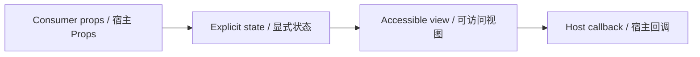

# PackageContentList / PackageContentList

> Reference ID: **C12** · 02 · 2.3

## 用途 / Purpose

`PackageContentList` is the reusable infission component mapped to `C12` in the reference board. It receives data through props and leaves routing, networking, permissions, payments, and business state to the consumer.

`PackageContentList` 是 `C12` 对应的可复用 infission 组件。组件通过 Props 接收数据并展示状态；路由、网络、权限、支付和业务状态由宿主项目负责。

## 安装与导入 / Install and import

```bash
pnpm add infisson_ui
```

```tsx
import { PackageContentList } from "infisson_ui";
import "infisson_ui/styles.css";
```

## Props / 属性

| Prop | Type | Required / default | 中文说明 / English |
|---|---|---|---|
| `sections` | `PackageSection[]` | required | 材料分组和文件行 / grouped package documents |
| `sections[].id`, `sections[].label` | `string` | required | 稳定分组标识与标题 / stable group identity and label |
| `sections[].documents` | `PackageDocument[]` | required | 文件数据；`id`, `name`, optional `pages`, `status`, `meta` / document data |
| `sections[].complete` | `boolean` | optional | 显示分组是否完成 / display completion state |
| `onPreviewDocument` | `(document: PackageDocument) => void` | optional | 文件行预览回调；缺省时图标保持装饰性 / preview callback; icon is decorative when omitted |
| `selectable` | `boolean` | default `true` | 显示原生文件选择框 / show native document selection checkboxes |
| `selectedDocumentIds` | `string[]` | optional | 受控选中 ID；传入后由宿主管理 / controlled selected IDs; host owns state |
| `defaultSelectedDocumentIds` | `string[]` | optional | 非受控初始选中 ID；缺省为全部文件 / uncontrolled initial IDs; defaults to all documents |
| `onDocumentSelectionChange` | `(document, selected) => void` | optional | 文件选择变化回调 / selection change callback |
| `emptyMessage` | `ReactNode` | default | 无文件时提示 / empty package copy |

`status` is display data only; this component never performs a download or portal request. The eye-shaped action means **Preview**, and exposes a labelled button only when `onPreviewDocument` is supplied. / `status` 仅用于展示，组件不会下载文件或调用门户。眼睛图标明确表示“预览”；只有传入 `onPreviewDocument` 时才会显示带标签的按钮。

## 可复制调用 / Copyable usage

```tsx
export function PackageContentListExample() {
  return (
    <section data-infisson aria-label="PackageContentList example">
      <PackageContentList
        sections={[{ id: "forms", label: "Permit forms", complete: true, documents: [{ id: "b1", name: "Building Permit Application", pages: 4, status: "generated" }] }]}
        defaultSelectedDocumentIds={["b1"]}
        onDocumentSelectionChange={(document, selected) => console.info("selection", document.id, selected)}
        onPreviewDocument={(document) => console.info("preview", document.id)}
      />
    </section>
  );
}
```

For components with required data, pass the required fields listed above; callbacks remain owned by the host application. / 如果组件需要必填数据，请按上表传入；回调由宿主应用负责。

## 状态与边界 / States and edge cases

- Default, hover, focus-visible, active/selected, disabled, loading, error, and empty states are explicit where supported by the component Props.
- Missing or unknown data stays visible as an empty or pending state; it must not be represented as a successful result.
- Long labels, zero values, missing media, duplicate clicks, and narrow viewports are handled without breaking the surrounding layout.
- State changes are interruptible, and callbacks are not fired twice for one user action.

- 默认、悬停、可见焦点、激活/选中、禁用、加载、错误和空状态按组件 Props 显式表达。
- 缺失或未知数据保持为空或待处理状态，不能伪装成成功。
- 长标签、零值、缺少图片、重复点击和窄视口不能破坏布局。
- 状态切换可中断，一次用户动作不会重复触发回调。

## 无障碍 / Accessibility

- Keep native semantics and visible labels; color alone never communicates state.
- Interactive elements are keyboard reachable and show a visible `:focus-visible` indicator.
- Important updates use an appropriate status or live region; decorative icons are hidden from assistive technology.
- `prefers-reduced-motion: reduce` disables non-essential movement.

- 保留原生语义和可见标签，不能只依赖颜色表达状态。
- 交互元素可用键盘访问，并显示清晰的 `:focus-visible` 焦点指示。
- 重要更新使用合适的 status 或 live region，装饰图标对辅助技术隐藏。
- `prefers-reduced-motion: reduce` 会关闭非必要动效。

## 主题与配图 / Theme and visual reference

```css
[data-infisson] {
  --inf-color-brand: #c5f33e;
  --inf-color-surface-inverse: #111214;
}
```


图片是静态范围基线；视频中未逐帧确认的行为会标为 `implementation-proposal`。The image is the static scope baseline; motion not verified frame-by-frame remains `implementation-proposal`.


