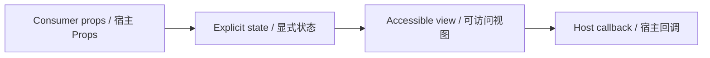

# SubmissionSuccessBanner / SubmissionSuccessPanel

> Reference ID: **C26** · 05 · 5.1

## 用途 / Purpose

`SubmissionSuccessPanel` is the reusable infission component mapped to `C26` in the reference board. It receives data through props and leaves routing, networking, permissions, payments, and business state to the consumer.

`SubmissionSuccessPanel` 是 `C26` 对应的可复用 infission 组件。组件通过 Props 接收数据并展示状态；路由、网络、权限、支付和业务状态由宿主项目负责。

## 安装与导入 / Install and import

```bash
pnpm add infisson_ui
```

```tsx
import { SubmissionSuccessPanel } from "infisson_ui";
import "infisson_ui/styles.css";
```

## Props / 属性

| Prop | Type | 中文说明 / English |
|---|---|---|
| `referenceId`, `filedAt`, `target`, `estimatedDecision` | `string` | 宿主提供的提交结果快照 / host-provided result snapshot |
| `amount` | `string` | 可选已支付金额文案 / optional paid amount copy |
| `connection` | `SubmissionConnection \| string` | 紧凑目标卡连接状态 / compact target connection state |
| `planReview` | `string` | 可选计划审核文案 / optional plan review copy |
| `notificationStatus` | `success \| pending \| failed` | 通知结果，不等同于提交结果 / notification delivery result |
| `notificationDetail`, `notificationSimulated` | `string`, `boolean` | 通知说明和演示披露 / notification copy and demo disclosure |
| `onDownloadReceipt`, `onOpenTracker` | `() => void` | 宿主处理的本地操作 / host-owned actions |
| `nextSteps` | `WorkflowNextStep[]` | 后续步骤 / next steps |

`dist/index.d.ts` 是发布包的权威声明；组件变体沿用同一 Props 契约。/ `dist/index.d.ts` is the authoritative declaration shipped with the package; visual variants use the same Props contract.

## 可复制调用 / Copyable usage

```tsx
export function SubmissionSuccessPanelExample() {
  return (
    <section data-infisson aria-label="SubmissionSuccessPanel example">
      <SubmissionSuccessPanel referenceId="INF-2026-11482" filedAt="Sep 24 at 9:12 AM" amount="$418 paid" target="Harbor County" estimatedDecision="Oct 2, 2026" notificationStatus="success" onDownloadReceipt={() => console.info("receipt")} onOpenTracker={() => console.info("tracker")} />
    </section>
  );
}
```

For components with required data, pass the required fields listed above; callbacks remain owned by the host application. / 如果组件需要必填数据，请按上表传入；回调由宿主应用负责。

## 状态与边界 / States and edge cases

- Default, hover, focus-visible, active/selected, disabled, loading, error, and empty states are explicit where supported by the component Props.
- Missing or unknown data stays visible as an empty or pending state; it must not be represented as a successful result.
- Long labels, zero values, missing media, duplicate clicks, and narrow viewports are handled without breaking the surrounding layout.
- State changes are interruptible, and callbacks are not fired twice for one user action.

- 默认、悬停、可见焦点、激活/选中、禁用、加载、错误和空状态按组件 Props 显式表达。
- 缺失或未知数据保持为空或待处理状态，不能伪装成成功。
- 长标签、零值、缺少图片、重复点击和窄视口不能破坏布局。
- 状态切换可中断，一次用户动作不会重复触发回调。

## 无障碍 / Accessibility

- Keep native semantics and visible labels; color alone never communicates state.
- Interactive elements are keyboard reachable and show a visible `:focus-visible` indicator.
- Important updates use an appropriate status or live region; decorative icons are hidden from assistive technology.
- `prefers-reduced-motion: reduce` disables non-essential movement.

- 保留原生语义和可见标签，不能只依赖颜色表达状态。
- 交互元素可用键盘访问，并显示清晰的 `:focus-visible` 焦点指示。
- 重要更新使用合适的 status 或 live region，装饰图标对辅助技术隐藏。
- `prefers-reduced-motion: reduce` 会关闭非必要动效。

## 主题与配图 / Theme and visual reference

```css
[data-infisson] {
  --inf-color-brand: #c5f33e;
  --inf-color-surface-inverse: #111214;
}
```


图片是静态范围基线；视频中未逐帧确认的行为会标为 `implementation-proposal`。The image is the static scope baseline; motion not verified frame-by-frame remains `implementation-proposal`.




